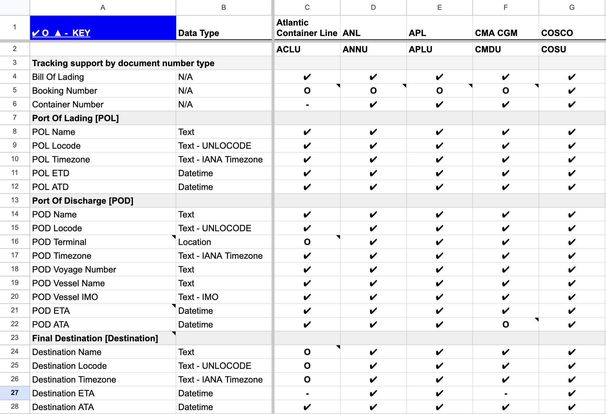

# Data Sources

- **Ocean Carriers (aka Steamship Lines):** Bill of lading/booking details, vessel ETA, containers and milestones
- **Container Terminal Operators:** Container availability, last free day, holds, fees etc.
- **Container Rail Carriers:** Container milestones via rail
- **AIS Data:** Vessel details and real-time location tracking (coming soon!)

## Supported Ocean Carriers
View a complete list of supported carriers and attributes on [Google Sheets](https://docs.google.com/spreadsheets/d/1cWK8sNpkjY5V-KlXe1fHi8mU_at2HcJYqjCvGQgixQk/edit#gid=0)

## Ports and Terminals
Currently, the Terminal49 API integrates with terminals at the following ports:
- Baltimore
- Boston
- Charleston
- Fraser Surrey (CA)
- Halifax (CA)
- Houston
- Jacksonville
- London Gateway (UK)
- Long Beach
- Los Angeles
- Miami
- Mobile
- New Orleans
- New York / New Jersey
- Oakland
- Philadelphia
- Port Everglades
- Portland
- Prince Rupert (CA)
- Savannah
- Seattle
- Southampton (UK)
- Tacoma
- Tampa
- Vancouver (CA)
- Virginia

You can view a complete list of supported terminals and attributes on [Google Sheets](https://docs.google.com/spreadsheets/d/1cWK8sNpkjY5V-KlXe1fHi8mU_at2HcJYqjCvGQgixQk/edit#gid=1406366493)

## Rail Carriers

- BNSF Railway
- Canadian National Railway (CN)
- Canadian Pacific Railway (CP)
- CSX Transportation
- Norfolk Southern Railway (NS)
- Union Pacific Railroad (UP)

## Known Issues (Ocean Carriers)
Shipment data is populated from requests to the shipping lines.

Below is a list of known issues with our data sources:

### CMA CGM, APL, ANL
- No container weight
- No container seal number

### Maersk, Sealand, Safmarine
- Shipment departure/arrival events are not always available depending on when the bill of lading is entered into the system
- No container seal number

### Hamburg Süd
- No estimated departure time
- No container weight
- No container seal number

### MSC
- No container seal number

### Hapag-Lloyd
- No container weight
- No container seal number

### Evergreen
- All dates are provided as dates, not datetimes. We record and return them all as midnight at the location the event happened (when location is available) or midnight UTC
- Only Dry, Reefer, and Flatpack container types are mapped to our system

### COSCO
- No departure or arrival events (does not affect departure/arrival times)

### OOCL
- No container seal number

### ONE
- Only Dry and Reefer container types are mapped to our system

### Yang Ming
- When bill of lading has multiple containers, the container weight returned is the average of the shipment (i.e., the bill of lading gross weight / number of containers)

### Hyundai Merchant Marine
- No container type

### ZIM
- No container weight
- No container seal number

### Westwood Shipping
- No container weight
- Only Dry container types are mapped to our system

# Data Fields & Availability

Below is a list of data that can be retrieved via the API, including whether it is always available, or whether it is only supported by certain carriers (Carrier Dependent), certain Terminals (Terminal Dependent) or on certain types of journeys (Journey Dependent).

## Shipment Data
Shipment Data is the primary data that comes from the Carrier. It contains the details of the shipment retrieved from the Bill of Lading and references multiple container objects.

| Data                                           | Availability            | More details           | Notes |
| ------ |-----|-----|-----|
| Port of Lading                                 | Always                               | Port of Lading name, Port of Lading UN/LOCODE, Port of Lading Timezone                |                                                                            |
| Port of Discharge                              | Always                               | Port of Discharge name, Port of Discharge UN/LOCODE, Port of Discharge Timezone        |                                                                            |
| Final Destination beyond Port of Discharge     | Carrier Dependent, Journey Dependent | Destination name, Destination UN/LOCODE, Destination Timezone | Only for shipments with inland moves provided by or booked by the carrier |
| Listing of Container Numbers                   | Always                               | A list of container numbers with data attributes listed below                         |                                                                            |
| Bill of Lading Number                          | Always (inputted by user)            | BOL                                                                                   |                                                                            |
| Shipping Line Details                          | Always                               | SCAC, SSL Name                                                                        |                                                                            |
| Voyage Details                                 | Milestone-based                      | Vessel Name, Vessel IMO, Voyage Number                                                |                                                                            |
| Estimated Time of Departure                    | Carrier Dependent                    | Timestamp                                                                             |                                                                            |
| Actual Time of Departure                       | Always                               | Timestamp                                                                             | After departure                                                            |
| Estimated Time of Arrival at Port of Discharge | Carrier Dependent                    | Timestamp                                                                             |                                                                            |
| Actual Time of Arrival at Port of Discharge    | Always                               | Timestamp                                                                             | Available after arrival                                                    |
| Estimated Time of Arrival at Final Destination | Carrier Dependent, Journey Dependent | Timestamp                                                                             | Only for vessels with inland moves                                        |

## Container Data
At the container level, the following data is available. Container data is combined from all sources to create a single data view of the container. Some of this data will only be available when certain milestones have passed.

|    Data          |     Availability          |                More Details                   |        Notes          |
| ---------------- | ----------------- | ------------------------------------------------ | -------------------- |
| Container Number | Always            | number                                           |                      |
| Seal Number      | Carrier Dependent | number                                           |                      |
| Equipment Type   | Always            | Dry, Reefer, Open Top, Flat Rack, Tank, Hard Top | Enumerated data type |
| Equipment Length | Always            | 20, 40, 45, 50                                   | Enumerated Data Type |
| Equipment Height | Always            | Standard, High Cube                              | Enumerated Data Type |
| Weight          | Carrier Dependent | Number                                           |                      |
| Terminal Availability              | Always            | Availability Known, Availability for Pickup | |
| Holds                              | Terminal Dependent| Array of statuses   | Each status includes the hold name (one of: Customs, Freight, TMF, Other, USDA) and the status (Pending, Hold) as well as any extra description|
| Fees                               | Terminal Dependent| Array of statuses| Each status includes the fee type (one of: Demurrage, Exam, Other) and the amount the hold is for (a float)|
| Last Free Day                      | Terminal Dependent| Date of last free day |     |
| Arrived at Port of Discharge       | Always            | Once Arrived |        |
| Discharged at Port of Discharge    | Always            | Once discharged          |                |
| Full Out at Port of Discharge      | Always            |  | |
| Full Out at Final Destination      | Journey Dependent | Only if non-port final destination |  |
| Rail Loaded at Port of Discharge   | Journey Dependent | Only if non-port final destination |  |
| Rail Departed at Port of Discharge | Journey Dependent | Only if non-port final destination |  |
| Rail Carrier SCAC at Port of Discharge |Journey Dependent | Only if non-port final destination | |
| ETA for Final Destination          | Carrier Dependent, Journey Dependent | Only if non-port final destination |  |
| ATA for Final Destination          | Journey Dependent | Only if non-port final destination |  |
| LFD at Final Destination           | Carrier Dependent, Journey Dependent | Only if non-port final destination |  |

## Milestone Event Data
When a milestone passes, the Terminal49 API will send a webhook notification with a Milestone event. For each milestone, the following data is always provided. Container, Shipment, Vessel, Location and Terminal data will be provided as objects that contain the information listed above.

| Milestone Data |         Description                                              |
| -------------- | ---------------------------------------------------------------- |
| Event Name     | The name of the event, e.g., 'container.transport.vessel_loaded' |
| Created At     | When the event was created in our system                         |
| Timestamp      | When the event occurred                                           |
| Timezone       | Which timezone the event occurred in                             |
| Voyage Number  | The voyage number of the vessel                                  |
| Container      | A link to the Container Data                                     |
| Shipment       | A link to the Shipment Data                                      |
| Vessel         | Which vessel the event occurred on                               |
| Location       | Where the event occurred                                         |
| Terminal       | Which terminal this occurred at                                  |

## Milestone Events Supported
Below is a list of milestones that the API can track, along with the event name used in the API. Additional events may be supported in the future.

|              Milestone Event Name        | Event Name           |
| -------------------- | -------------------------------------- |
| Vessel Loaded   | container.transport.vessel_loaded |
| Vessel Departed   | container.transport.vessel_departed |
| Vessel Arrived    | container.transport.vessel_arrived |
| Vessel Berthed    | container.transport.vessel_berthed |
| Vessel Discharged   | container.transport.vessel_discharged |
| Empty Out   | container.transport.empty_out |
| Full In   | container.transport.full_in |
| Full Out    | container.transport.full_out |
| Empty In    | container.transport.empty_in |
| Rail Departed   | container.transport.rail_departed |
| Rail Arrived    | container.transport.rail_arrived |
| Rail Loaded   | container.transport.rail_loaded |
| Rail Unloaded   | container.transport.rail_unloaded |
| Transshipment Arrived   | container.transport.transshipment_arrived |
| Transshipment Discharged    | container.transport.transshipment_discharged |
| Transshipment Loaded    | container.transport.transshipment_loaded |
| Transshipment Departed    | container.transport.transshipment_departed |
| Feeder Arrived    | container.transport.feeder_arrived |
| Feeder Discharged   | container.transport.feeder_discharged |
| Feeder Loaded   | container.transport.feeder_loaded |
| Feeder Departed   | container.transport.feeder_departed |
| Arrived at Inland Destination   | container.transport.arrived_at_inland_destination |
| Estimated Arrived at Inland Destination   | container.transport.estimated.arrived_at_inland_destination |
| Pickup LFD Changed   | container.pickup_lfd.changed |