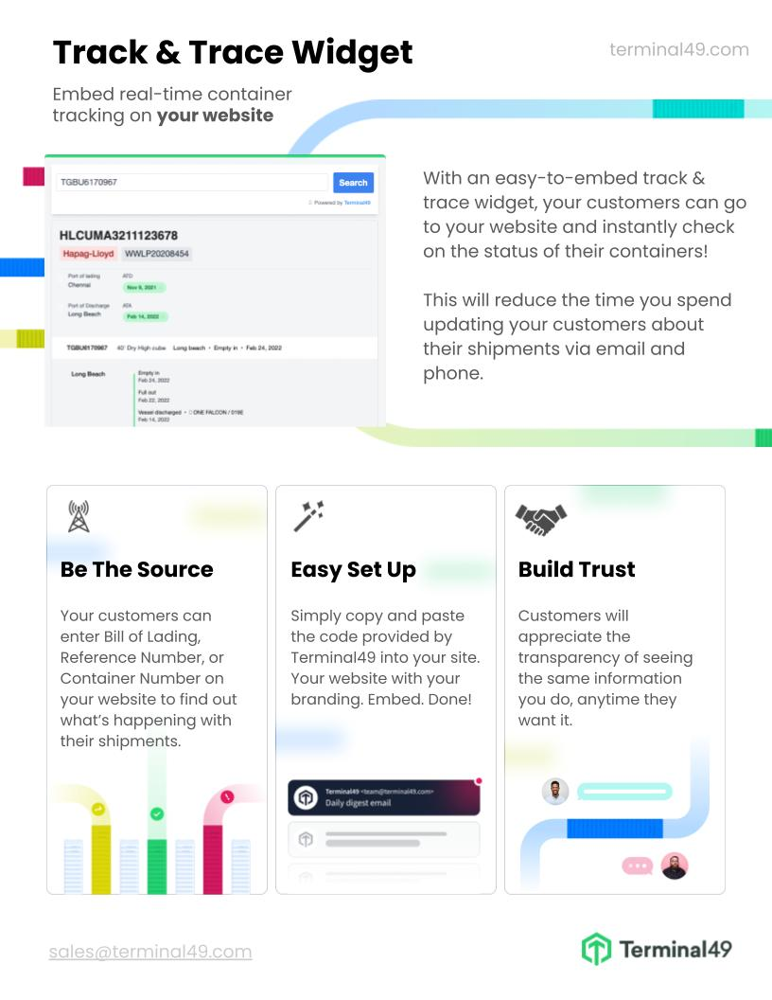

# Tracking Widget Embed Guide

The Terminal49 Track & Trace Widget allows you to embed real-time container tracking on your website with just a few lines of code. This widget provides a seamless user experience and helps improve customer satisfaction.

### How do I embed the widget on my website?

> First, you neeed a publishable API KEY. You can get this by reaching out to us at support@terminal49.com 


Once you have the key, you can embed the widget on your website. We suggest creating a dedicated page for tracking, typically at `company-website.com/track`. You can also embed the widget directly on your homepage. If you decide to create a dedicated tracking page, we recommend adding a `h1` tag above the script. Feel free to customize the `h1` contents in the script.

Copy and pase the code below and insert it on top of the page (under your page navigation if you a horizontal top navigation). Replace `REPLACE_WITH_PUBLISHABLE_KEY` with the `API KEY` you receive from us. We suggest adding a `h1` tag above the script. Feel free to remove change the `h1` contents in the script below. 


```html

<h1> Tracking </h1>
<script src="https://kit.fontawesome.com/cd34e860ca.js" crossorigin="anonymous"></script>
<div id="terminal49-tnt-widget" data-token="REPLACE_WITH_PUBLISHABLE_KEY"></div>
<script src="https://widget.terminal49.com/app.bundle.js"></script>
```


## Frequently Asked Questions 

### How does it work? 

With a few lines of code, you can embed an interactive container tracking form. Once the widget is live on your website, your customer can enter a master bill of lading, container number, or reference numbers that a shipment is tagged with. After the number has been entered, the widget will retrieve and display shipment and container details from your Terminal49 account.

### Do I need Terminal49 account? 
Yes, the information that fetched and displayed by the widget is based on the shipments and containers tracked within your Terminal49 account. 

### Can my customer track *any* shipment/container? 
No, only the shipments and containers that are tracked in your Terminal49 account. 

### Is there a cost to embed the widget? 
Yes, there is a $500/month fee to embed and use the widget. This include unlimited number of visitors and tracking requests.  


## Terminal49 container tracking widget one-pager

Here is a one-pager that describes the benefits of the Track & Trace Widget. Feel free to share it with your team or management if you want to demonstrate the benefits of adding track and trace functionality to your website.

The Track & Trace Widget provides a number of advantages:

- It offers your customers a convenient way to track their shipments and containers.
- It helps to improve customer satisfaction by providing accurate container status.
- It can reduce customer service costs by providing customers with the information they need without having to contact customer service.
- It can help you differentiate from other service providers. 



