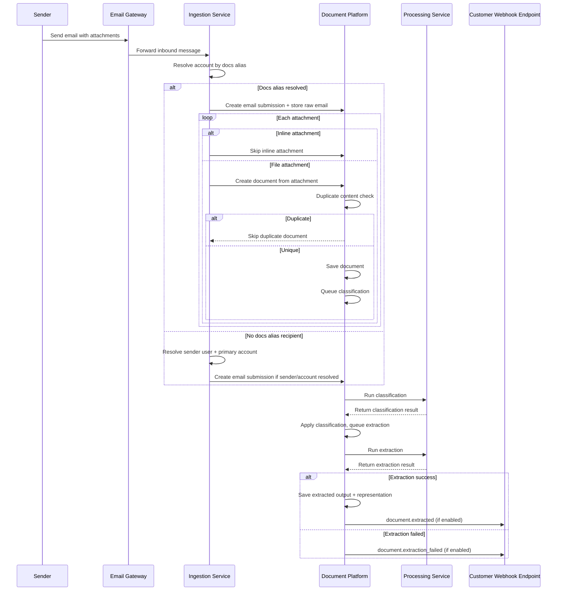
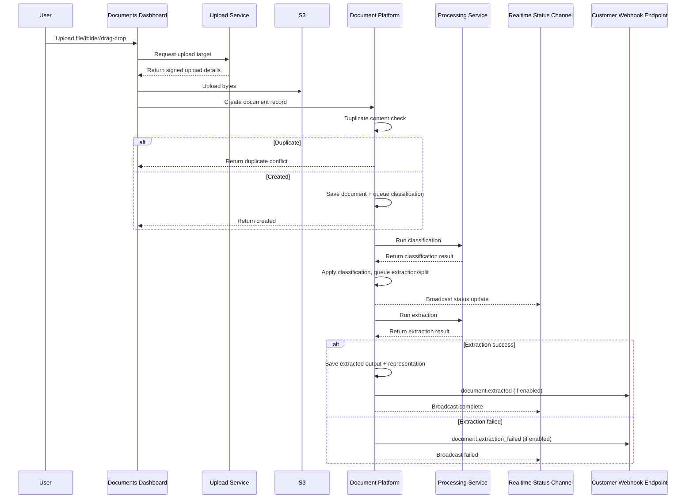

Terminal49 supports two primary document submission workflows:

- **Email submission** to your account-specific docs alias
- **Web submission** from the Documents dashboard upload flow

Both workflows converge into the same backend processing lifecycle: classification, extraction, and downstream API/webhook consumption.

## Workflow Diagrams

### Email submission workflow

### Web submission workflow (Documents dashboard)

## Prerequisites

- A Terminal49 account with API access.
- An API key for `Authorization: Token YOUR_API_KEY`.
- If using email submission: account docs alias configured and mail routed to `@docs.terminal49.com`.
- If using webhooks: an active webhook subscribed to document events.

<Info>
Document webhook events are enabled per account.
If your account does not have this enabled, you will not receive document webhook deliveries.
</Info>

## Workflow Details

### 1) Email submission workflow

<Steps>
  <Step title="Send email to docs alias">
    Send an email with one or more file attachments to your account docs address (for example, `your-alias@docs.terminal49.com`).
  </Step>
  <Step title="Submission is recorded">
    The inbound email is recorded as an `email_submission`.
  </Step>
  <Step title="Attachment ingestion and dedupe">
    Inline attachments are skipped. File attachments are converted to `document` records, then checked for duplicate content by checksum. Duplicates are skipped and only unique files continue to processing.
  </Step>
  <Step title="Asynchronous processing">
    For each accepted document, classification and extraction are kicked off asynchronously.
  </Step>
  <Step title="Consume results">
    Read results from `/documents`, `/email_submissions`, and `last_document_representation`, or consume document webhook events.
  </Step>
</Steps>

<Note>
Today, receiving an email does **not** emit a dedicated `email_submission.created` webhook.
Only document extraction outcome events are emitted.
</Note>

### 2) Web submission workflow (dashboard upload)

<Steps>
  <Step title="Client uploads file to storage">
    The dashboard uploads file bytes to storage, then creates the document record using the returned upload token.
  </Step>
  <Step title="Create document record">
    The dashboard creates the document record after upload completes.
  </Step>
  <Step title="Duplicate handling">
    If the same file already exists for your account, the upload is marked as duplicate and not processed again.
  </Step>
  <Step title="Asynchronous processing and UI status">
    Classification/extraction run asynchronously; dashboard status updates as processing progresses.
  </Step>
  <Step title="Consume extracted outputs">
    Use document resource fields plus `last_document_representation` for schema-versioned payloads.
  </Step>
</Steps>

<Tip>
For robust integrations, treat document extraction as asynchronous: expect eventual consistency and react to webhook outcomes or poll document endpoints.
</Tip>

## Webhook Lifecycle

Live document-management webhook events:

| Event | Trigger | Relationship in payload |
| --- | --- | --- |
| `document.extracted` | Extraction succeeded and representation was created | `document` |
| `document.extraction_failed` | Extraction job failed | `document` |

Use [`GET /webhook_notifications/examples`](/api-docs/api-reference/webhook-notifications/get-webhook-notification-payload-examples) to inspect sample payloads.
Use [`POST /webhooks/trigger`](/api-docs/api-reference/webhooks/trigger-a-webhook) to send test webhook notifications to your endpoint.

<Warning>
`GET /webhook_notifications` and `GET /webhook_notifications/{id}` do not return document webhook deliveries.
Use the examples endpoint for document payload contracts and rely on your webhook endpoint for live delivery.
</Warning>

## API Surfaces You Will Use

- [`/api-docs/api-reference/documents/list-documents`](/api-docs/api-reference/documents/list-documents)
- [`/api-docs/api-reference/documents/upload-a-document`](/api-docs/api-reference/documents/upload-a-document)
- [`/api-docs/api-reference/email-submissions/list-email-submissions`](/api-docs/api-reference/email-submissions/list-email-submissions)
- [`/api-docs/api-reference/document-schemas/get-a-document-schema`](/api-docs/api-reference/document-schemas/get-a-document-schema)
- [`/api-docs/api-reference/document-representations/document-representations-resource`](/api-docs/api-reference/document-representations/document-representations-resource)

## Planned Changes (Not Live Yet)

- New webhook event planned: `email_submission.created` after inbound email acceptance.

<Info>
This planned change is intentionally documented here for roadmap visibility. It is not yet part of the live API contract in `openapi.json`.
</Info>

## Expected Outcomes

After implementing this guide, you should be able to:

- ingest documents through email and dashboard upload
- detect and handle duplicate uploads cleanly
- observe async processing status and extraction completion/failure
- consume extracted payloads via `last_document_representation`
- integrate document webhook outcomes into your downstream systems

## Troubleshooting Checklist

- Verify webhook subscription contains document events and is active.
- Confirm your account has document webhook events enabled.
- For missing extracted payloads, check whether extraction failed and handle `document.extraction_failed`.
- For email flow issues, validate recipient matches your docs alias and sender/account resolution rules.
- For upload failures, check direct upload completion before creating `/documents`.
