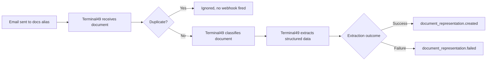

Shipping documents (House Bills of Lading, Master Bills of Lading, arrival notices, delivery orders, and more) arrive in shared inboxes and have traditionally required manual classification, data entry, and filing. This integration automates that workflow: Terminal49 receives each document by email, classifies it, extracts structured fields, and delivers the results to your system via webhook.

The outcome is less manual re-keying, faster time-to-file, and fewer errors from misfiled or delayed documents, freeing your team from routine data entry to focus on true exceptions.

Submit documents by emailing attachments to your account docs alias. Terminal49 then handles the rest: classify -\> extract -\> webhook result.

## Coming Soon

- **Webhook testing scenarios:** Terminal49 is building a way to trigger realistic `document_representation.created` and `document_representation.failed` webhook payloads for specific document types without needing to email a real document. This will let you develop and test your endpoint without incurring processing costs.
- **`email_submission.created` event:** a webhook fired immediately on email receipt, before classification and extraction complete.
- **Action required flow:** documentation in progress.

## Before You Start

Make sure you have the following in place before building:

<Steps>
  <Step title="Terminal49 account access">
    Confirm you can log in and switch between the test and production accounts (see [Environments](#environments) below).
  </Step>
  <Step title="API key">
    Generate an API key from **User > Developers > API Keys**. You'll need this to register your webhook and call the API.
  </Step>
  <Step title="A publicly accessible HTTPS endpoint">
    Your server needs a reachable HTTPS URL to receive webhook POST requests from Terminal49. For local development, use a tool like [ngrok](https://ngrok.com) to expose a local port.
  </Step>
  <Step title="Webhook subscription">
    Register your endpoint and subscribe to `document_representation.created` and `document_representation.failed` (see [Subscribing to Events](#subscribing-to-events) below).
  </Step>
</Steps>

## Environments

Your Terminal49 account has two environments, both accessible from the account switcher in the top-left corner when you log in:

| Environment | Account name |
| --- | --- |
| Test | Wayfair Development (Castlegate Logistics) |
| Production | Wayfair LLC |

<Warning>
  Both environments make live calls. Documents submitted under either account are processed and costs will be incurred. There is no free sandbox for document processing at this time. See [Coming Soon](#coming-soon) above for upcoming test tooling.
</Warning>

## Authentication

All API calls require an API key passed as a Bearer token:

```
Authorization: Token YOUR_API_KEY
```

To get your API key, go to **User > Developers > API Keys** (click your username in the bottom-left corner of the navigation). For more detail, see [Start Here](/api-docs/getting-started/start-here).

## Subscribing to Events

Register a webhook endpoint to receive document processing notifications:

```bash
curl -X POST https://api.terminal49.com/v2/webhooks \
  -H "Authorization: Token YOUR_API_KEY" \
  -H "Content-Type: application/vnd.api+json" \
  -d '{
    "data": {
      "type": "webhook",
      "attributes": {
        "url": "https://your-server.com/webhooks/t49-documents",
        "active": true,
        "events": [
          "document_representation.created",
          "document_representation.failed"
        ]
      }
    }
  }'
```

You can also configure webhooks from the Terminal49 dashboard:

1. Click your username in the bottom-left corner of the navigation.
2. Go to **User > Developers > Webhooks**.
3. To add a new endpoint, click **Create Webhook**, fill in your URL, and select the relevant events under **Document Events**.
4. To update an existing endpoint, click into it and toggle on the document events you need.

## Webhook Endpoint Requirements

Your endpoint must meet the following requirements to reliably receive webhook notifications:

**Response codes:** Return HTTP `200`, `201`, `202`, or `204`. Any other response (including a timeout) is treated as a delivery failure and will trigger retries.

**Retries:** Terminal49 will retry failed deliveries multiple times. Design your endpoint to be idempotent. Use `data.id` (the `webhook_notification` UUID) as your idempotency key to avoid processing the same event twice.

**HTTPS:** Your endpoint must be accessible over HTTPS.

**IP allowlist:** Webhook notifications are sent from the following IP addresses. Allowlist these if your infrastructure restricts inbound traffic:

```
35.222.62.171
3.230.67.145
44.217.15.129
```

**Signature verification (recommended):** Each webhook is signed using HMAC SHA-256. The signature is included in the `X-T49-Webhook-Signature` header. To verify, retrieve the `secret` from your webhook configuration and compute the HMAC digest of the raw request body; it should match the header value.

```ruby
secret = ENV.fetch('T49_WEBHOOK_SECRET')
hmac = OpenSSL::HMAC.hexdigest('SHA256', secret, request.body.read)
verified = request.headers['X-T49-Webhook-Signature'] == hmac
```

## Workflow Diagrams



## Workflow: Step-by-Step

<Steps>
  <Step title="Submit document">
    Email attachments to your account docs alias:

    | Environment | Email address |
    | --- | --- |
    | Test | `wayfair-development-castlegate-logistics-60@docs.terminal49.com` |
    | Production | `wayfair-llc-96@docs.terminal49.com` |

    **Supported file types:** PDF, PNG, JPEG, XLSX, XLS, CSV, Word (.doc, .docx).

    **Multiple attachments:** Each attachment in a single email is processed independently and generates its own webhook event. All resulting webhooks reference the same `email_submission`.

    **Unsupported files:** Encrypted or password-protected files cannot be processed and will result in a `document_representation.failed` event.
  </Step>
  <Step title="Terminal49 processes document">
    Terminal49 classifies and extracts structured data asynchronously. Processing typically completes within seconds to a few minutes depending on document complexity.
  </Step>
  <Step title="Receive webhook result">
    You receive `document_representation.created` (extraction succeeded) or `document_representation.failed` (extraction could not complete). Parse the payload, route by `document_type`, store the extracted fields, and trigger your downstream processes.
  </Step>
</Steps>

<Tip>
  Treat submission as fire-and-forget. Do not poll or wait for a response after sending the email. The webhook is the signal that processing is complete.
</Tip>

<Note>
  If the same file content has already been processed for your account, it is treated as a duplicate and ignored. No webhook is fired.
</Note>

## Webhooks You Should Handle

A `document_representation` is the structured extraction result for a document. `document_representation.created` means extraction succeeded and structured data is available in the payload. `document_representation.failed` means Terminal49 could not produce an extraction result.

| Event | Meaning | Signal |
| --- | --- | --- |
| `document_representation.created` | Extraction completed successfully | `document_type` is set; `payload` contains extracted fields |
| `document_representation.failed` | Extraction did not complete | `document_type` is `"unknown"`; `last_document_representation` is `null` |

## Webhook Payload Structure

Every document webhook follows the same envelope structure. The `payload` object inside `document_representation` contains the extracted fields and varies by document type. See [Document Types in Scope](#document-types-in-scope) for full examples.

`document_representation.created` envelope:

```json
{
  "data": {
    "id": "89ec3520-cea3-447d-8404-341e0bfd3aa6",
    "type": "webhook_notification",
    "attributes": {
      "event": "document_representation.created",
      "delivery_status": "pending",
      "created_at": "2026-03-27T20:05:39Z"
    },
    "relationships": {
      "document": {
        "data": {
          "id": "e75541c0-9ad5-408b-9747-23415adfbca0",
          "type": "document"
        }
      }
    }
  },
  "included": [
    {
      "id": "b3abc297-624a-4eaa-a0e9-4ac4ebbd064f",
      "type": "document_representation",
      "attributes": {
        "schema_version": "draft_house_bill_of_lading@2026-03-23",
        "payload": {},
        "created_at": "2026-03-27T20:05:39Z",
        "updated_at": "2026-03-27T20:05:39Z"
      }
    },
    {
      "id": "e75541c0-9ad5-408b-9747-23415adfbca0",
      "type": "document",
      "attributes": {
        "document_type": "draft_house_bill_of_lading",
        "source": "email",
        "file_name": "invoice.pdf",
        "file_url": "https://t49-documents-prod.s3.amazonaws.com/..."
      },
      "relationships": {
        "email_submission": {
          "data": {
            "id": "7de2c356-5d2a-4d6e-99f4-6f0d2d63e357",
            "type": "email_submission"
          }
        },
        "last_document_representation": {
          "data": {
            "id": "b3abc297-624a-4eaa-a0e9-4ac4ebbd064f",
            "type": "document_representation"
          }
        }
      }
    }
  ]
}
```

<Note>
  `file_url` is a pre-signed S3 URL and expires after 1 hour. Download the file promptly after receiving the webhook, or fetch a fresh URL using the endpoint below.
</Note>

### Fetching a fresh download URL

If the `file_url` from the webhook has expired, request a new one:

```bash
curl -X GET https://api.terminal49.com/v2/documents/{id}/download_url \
  -H "Authorization: Token YOUR_API_KEY"
```

Replace `{id}` with the document `id` from the webhook payload. Response:

```json
{
  "download_url": "https://t49-documents-prod.s3.amazonaws.com/..."
}
```

### Schema versioning

Every webhook payload includes a `schema_version` field that identifies the document type and the schema date in use:

```
"schema_version": "draft_house_bill_of_lading@2026-03-23"
```

Your account is pinned to a specific schema date. All document types will use the latest schema version up to and including that date. Terminal49 can update your pinned version when you are ready to migrate.

**What changes the version:**
- Breaking changes (fields removed, renamed, or restructured) increment the date. Terminal49 will either support parallel versions during a migration window or coordinate a cutover date with you.
- Non-breaking additions (new optional fields) do not change the version.

Use `schema_version` to route your parsing logic. If you support multiple versions, branch on this field.

### Persisting extracted data

Use the `document_type` and `schema_version` to look up the expected `payload` fields for that document type, then store the extracted data in your system.

### Handling a failed extraction

If extraction fails, you will receive `document_representation.failed` instead. The key signal is `"document_type": "unknown"` means the document was received but could not be classified or extracted. There is no `document_representation` in `included` and `last_document_representation` will be `null`.

```json
{
  "data": {
    "id": "014551bd-32c8-46c1-b17c-3a9f1984e39f",
    "type": "webhook_notification",
    "attributes": {
      "event": "document_representation.failed",
      "delivery_status": "pending",
      "created_at": "2026-03-27T20:46:56Z"
    },
    "relationships": {
      "document": {
        "data": {
          "id": "31e9df4a-7539-4b44-8409-8e9c350d2ac7",
          "type": "document"
        }
      }
    }
  },
  "included": [
    {
      "id": "90df411d-b836-498b-bf0d-b320d56ab311",
      "type": "email_submission",
      "attributes": {
        "subject": "[ediDocManager SHP HBL MBL HLCUSHA2601APKY2 / HBL CGGMSGH5110912]",
        "from": ["sender@wayfair.com"],
        "sent_at": "2026-03-27T13:46:32-07:00"
      }
    },
    {
      "id": "31e9df4a-7539-4b44-8409-8e9c350d2ac7",
      "type": "document",
      "attributes": {
        "document_type": "unknown",
        "file_name": "f134a7229b5cf7b6c241c566448b9293_fail-1234.pdf",
        "file_url": "https://t49-documents-prod.s3.amazonaws.com/..."
      },
      "relationships": {
        "last_document_representation": {
          "data": null
        },
        "email_submission": {
          "data": {
            "id": "90df411d-b836-498b-bf0d-b320d56ab311",
            "type": "email_submission"
          }
        }
      }
    }
  ]
}
```

<Warning>
  `document_type: "unknown"` means Terminal49 could not classify or extract the document. Log the document `id` and `file_url` for investigation. If failures recur on the same document type, contact Terminal49 support.
</Warning>

## Document Types in Scope

The table below maps Wayfair's document type names to the `document_type` values returned by the API, along with the actual source documents Terminal49 may receive and classify into each type.

| Wayfair Document Type | `document_type` value | Observed Documents | Notes |
| --- | --- | --- | --- |
| Draft House Bill of Lading | `draft_house_bill_of_lading` | House Bill of Lading | `hbl_type: "DRAFT"` in payload |
| Final House Bill of Lading | `final_house_bill_of_lading` | House Bill of Lading | `hbl_type: "TELEX"` in payload |
| Importer Security Filing | `importer_security_filing` | Importer Security Filing | |
| Master Bill of Lading | `master_bill_of_lading` | Sea Waybill | |
| Dray Delivery Order | `dray_delivery_order` | Delivery Order (Castlegate variant), Delivery Order (Non-Castlegate variant) | Both variants map to the same `document_type` |
| ARC | _pending (see note)_ | Arrival Notice, General Notice, Container Available Notice, In Bond, Freight Invoice | Wayfair uses "ARC" as an umbrella label, but these are distinct document types. Terminal49 recommends surfacing each as its own `document_type` so Wayfair can route without secondary classification and receive more accurate extracted data, as each document type has its own schema with fields specific to that document. Mapping to a single `arc` type would require additional work on Terminal49's side and would reduce data resolution if Wayfair stores the webhook payload. Specific values TBD. |

Additional document types will be added in future phases.

<Info>
  **Null fields are intentional.** A `null` value means Terminal49 looked for that field in the source document but did not find it. Treat `null` as "checked, not present" rather than "field not supported" or "not checked".
</Info>

### Draft House Bill of Lading: Full Webhook Payload

`schema_version: draft_house_bill_of_lading@2026-03-23`

```json
{
  "data": {
    "id": "925298f4-dd2e-43c7-bdc6-690d92cc55bc",
    "type": "webhook_notification",
    "attributes": {
      "event": "document_representation.created",
      "delivery_status": "pending",
      "created_at": "2026-03-27T20:05:03Z"
    },
    "relationships": {
      "document": {
        "data": { "id": "1272e0d7-7989-4d3a-88a9-fceac6c9d239", "type": "document" }
      }
    }
  },
  "included": [
    {
      "id": "86bd0705-6478-4e14-9a8a-2cea84329636",
      "type": "document_representation",
      "attributes": {
        "schema_version": "draft_house_bill_of_lading@2026-03-23",
        "created_at": "2026-03-27T20:05:03Z",
        "updated_at": "2026-03-27T20:05:03Z",
        "payload": {
          "hbl_type": "DRAFT",
          "hbl_number": "CGGMSGH5110912",
          "carrier_booking_number": "HLCUSHA2601APKY2",
          "reference_number_isf": "CGGMSGH5110912",
          "fmc_oti_number": "026564N",
          "date_of_issue": "13-02-2026",
          "shipped_on_board_date": "17-Feb-26",
          "freight_payment_terms": "PREPAID",
          "service_mode": "CFS/CY",
          "vessel_name": "GUSTAV MAERSK",
          "voyage_number": "606E",
          "port_of_loading": "SHANGHAI,CHINA",
          "port_of_discharge": "LOS ANGELES, CALIFORNIA, USA",
          "place_of_receipt": "SHANGHAI,CHINA",
          "place_of_delivery": "PERRIS, CALIFORNIA, USA",
          "point_and_country_of_origin": "SHANGHAI,CHINA",
          "signed_at": "SHANGHAI",
          "signed_by": "MAERSK LOGISTICS & SERVICE CHINA LIMITED as agent of the Carrier",
          "shipper": {
            "name": "FUZHOU LIGHT INDUSTRY IMPORT & EXPORT CO.,LTD",
            "address": "8/F.,TAIYANG PLAZA,NO.278,HUDONG AVENUE FUZHOU,CHINA"
          },
          "consignee": {
            "name": "GOLDENSEE LIMITED",
            "address": "C/O CASTLEGATE LOGISTICS INC 3300 INDIAN AVE, PERRIS SMALL PARCEL PERRIS, CA 92571"
          },
          "notify_party": {
            "name": "MOHAWK GLOBAL LOGISTICS",
            "email": "NJIMPORTS@MOHAWKGLOBAL.COM",
            "phone": "732-218-9164",
            "address": "105 FIELDCREST AVE, SUITE 404 EDISON, NJ 08837"
          },
          "containers": [
            {
              "container_number": "FDCU0184438",
              "seal_number": "HLK6247958",
              "container_size": "40HIGH",
              "gross_weight": "1116.75",
              "weight_unit": "KGS",
              "measurement": "5.736",
              "measurement_unit": "CBM",
              "number_of_packages": "24",
              "package_unit": "CARTONS",
              "cargo_references": ["WFH1G9800163", "WFH1G9800162"]
            }
          ],
          "line_items": [
            {
              "description": "THE SOFA",
              "quantity": "24",
              "quantity_unit": "CARTONS",
              "weight": "1116.75",
              "weight_unit": "KGS",
              "measurement": "5.736",
              "measurement_unit": "CBM",
              "hts_codes": ["9401616031"],
              "cargo_references": ["WFH1G9800163", "WFH1G9800162"]
            }
          ],
          "totals": {
            "number_of_packages": "24",
            "package_unit": "CARTONS",
            "gross_weight": "1116.75 KGS",
            "weight_unit": "KGS",
            "measurement": "5.736 CBM",
            "measurement_unit": "CBM"
          }
        }
      }
    },
    {
      "id": "3bdf78ea-a86c-40b5-b650-a1d79542808a",
      "type": "email_submission",
      "attributes": {
        "subject": "[ediDocManager SHP HBL MBL HLCUSHA2601APKY2 / HBL CGGMSGH5110912]",
        "from": ["sender@wayfair.com"],
        "sent_at": "2026-03-27T13:03:05-07:00"
      }
    },
    {
      "id": "1272e0d7-7989-4d3a-88a9-fceac6c9d239",
      "type": "document",
      "attributes": {
        "document_type": "draft_house_bill_of_lading",
        "source": "email",
        "file_name": "f134a7229b5cf7b6c241c566448b9293.pdf",
        "file_url": "https://t49-documents-prod.s3.amazonaws.com/..."
      },
      "relationships": {
        "last_document_representation": {
          "data": { "id": "86bd0705-6478-4e14-9a8a-2cea84329636", "type": "document_representation" }
        },
        "email_submission": {
          "data": { "id": "3bdf78ea-a86c-40b5-b650-a1d79542808a", "type": "email_submission" }
        }
      }
    }
  ]
}
```

### Final House Bill of Lading: Full Webhook Payload

`schema_version: final_house_bill_of_lading@2026-03-23`

```json
{
  "data": {
    "id": "89ec3520-cea3-447d-8404-341e0bfd3aa6",
    "type": "webhook_notification",
    "attributes": {
      "event": "document_representation.created",
      "delivery_status": "pending",
      "created_at": "2026-03-27T20:05:39Z"
    },
    "relationships": {
      "document": {
        "data": { "id": "e75541c0-9ad5-408b-9747-23415adfbca0", "type": "document" }
      }
    }
  },
  "included": [
    {
      "id": "b3abc297-624a-4eaa-a0e9-4ac4ebbd064f",
      "type": "document_representation",
      "attributes": {
        "schema_version": "final_house_bill_of_lading@2026-03-23",
        "created_at": "2026-03-27T20:05:39Z",
        "updated_at": "2026-03-27T20:05:39Z",
        "payload": {
          "hbl_type": "TELEX",
          "hbl_number": "CGGMXIM1554317",
          "carrier_booking_number": "MAEU263829038",
          "reference_number_isf": "CGGMXIM1554317",
          "fmc_oti_number": "026564N",
          "date_of_issue": "13-02-2026",
          "shipped_on_board_date": "31-Jan-26",
          "freight_payment_terms": "PREPAID",
          "service_mode": "CFS/CY",
          "vessel_name": "SYNERGY BUSAN",
          "voyage_number": "604N",
          "port_of_loading": "XIAMEN,CHINA",
          "port_of_discharge": "JACKSONVILLE,FLORIDA,USA",
          "place_of_receipt": "XIAMEN,CHINA",
          "place_of_delivery": "JACKSONVILLE,FLORIDA,USA",
          "point_and_country_of_origin": "XIAMEN,CHINA",
          "signed_at": "XIAMEN",
          "signed_by": "MAERSK LOGISTICS & SERVICE CHINA LIMITED as agent of the Carrier",
          "shipper": {
            "name": "TOTAL WIN HOME PRODUCTS CO.,LTD",
            "address": "ROOM 601-604, ZHONGXI TIMES TOWER, NO. 26 OF HONGQI ROAD, NANCHENG DISTRICT, DONGGUAN CITY GUANGDONG PROVINCE, CHINA"
          },
          "consignee": {
            "name": "UNIVERSE HOME INC.",
            "address": "1546 NW 56TH STREET, SEATTLE, WA, 98107, UNITED STATES"
          },
          "notify_party": {
            "name": "MOHAWK GLOBAL LOGISTICS",
            "email": "NJIMPORTS@MOHAWKGLOBAL.COM",
            "phone": "732-218-9164",
            "address": "105 FIELDCREST AVE, SUITE 404 EDISON, NJ 08837"
          },
          "containers": [
            {
              "container_number": "CAAU4786387",
              "seal_number": "CN5274554",
              "container_size": "40HIGH",
              "gross_weight": "451.7",
              "weight_unit": "KGS",
              "measurement": "2.412",
              "measurement_unit": "CBM",
              "number_of_packages": "37",
              "package_unit": "CARTONS",
              "cargo_references": ["ACN SPO WHS-41414-42378538"]
            },
            {
              "container_number": "CAAU4786387",
              "seal_number": "CN5274554",
              "container_size": "40HIGH",
              "gross_weight": "862",
              "weight_unit": "KGS",
              "measurement": "4.724",
              "measurement_unit": "CBM",
              "number_of_packages": "26",
              "package_unit": "CARTONS",
              "cargo_references": ["ACN SPO WHS-41414-42378549"]
            }
          ],
          "line_items": [
            {
              "description": "PET GATE",
              "weight": "1313.7",
              "weight_unit": "KGS",
              "measurement": "7.136",
              "measurement_unit": "CBM",
              "hts_codes": ["442199"]
            },
            {
              "description": "PET RAMP",
              "hts_codes": ["442199"],
              "cargo_references": ["ACI SPO: WHS-41414-42267479"]
            },
            {
              "description": "DOG HOUSE",
              "hts_codes": ["442199"]
            },
            {
              "description": "COMMODITY SHELF",
              "hts_codes": ["442199"],
              "cargo_references": ["ACI SPO: WHS-41414-42267481"]
            }
          ],
          "totals": {
            "number_of_packages": "63",
            "package_unit": "CARTONS",
            "gross_weight": "1313.7 KGS",
            "weight_unit": "KGS",
            "measurement": "7.136 CBM",
            "measurement_unit": "CBM"
          }
        }
      }
    },
    {
      "id": "048bfec4-1249-4239-ab5b-63ad1e8f70cf",
      "type": "email_submission",
      "attributes": {
        "subject": null,
        "from": ["sender@wayfair.com"],
        "sent_at": "2026-03-27T23:03:18+03:00"
      }
    },
    {
      "id": "e75541c0-9ad5-408b-9747-23415adfbca0",
      "type": "document",
      "attributes": {
        "document_type": "final_house_bill_of_lading",
        "source": "email",
        "file_name": "c4b16d8360049ea688367f6192dba07b.pdf",
        "file_url": "https://t49-documents-prod.s3.amazonaws.com/..."
      },
      "relationships": {
        "last_document_representation": {
          "data": { "id": "b3abc297-624a-4eaa-a0e9-4ac4ebbd064f", "type": "document_representation" }
        },
        "email_submission": {
          "data": { "id": "048bfec4-1249-4239-ab5b-63ad1e8f70cf", "type": "email_submission" }
        }
      }
    }
  ]
}
```

### ISF (Importer Security Filing): Full Webhook Payload

`schema_version: importer_security_filing@2026-03-30`

```json
{
  "data": {
    "id": "89ec3520-cea3-447d-8404-341e0bfd3aa6",
    "type": "webhook_notification",
    "attributes": {
      "event": "document_representation.created",
      "delivery_status": "pending",
      "created_at": "2026-03-27T20:05:39Z"
    },
    "relationships": {
      "document": {
        "data": { "id": "e75541c0-9ad5-408b-9747-23415adfbca0", "type": "document" }
      }
    }
  },
  "included": [
    {
      "id": "b3abc297-624a-4eaa-a0e9-4ac4ebbd064f",
      "type": "document_representation",
      "attributes": {
        "schema_version": "importer_security_filing@2026-03-30",
        "created_at": "2026-03-27T20:05:39Z",
        "updated_at": "2026-03-27T20:05:39Z",
        "payload": {
          "importer_name": "Hulk International Limited",
          "importer_of_record_number": null,
          "po_numbers": ["WHS-64134-41828780"],
          "description_of_goods": null,
          "bol_type": null,
          "hbl_number": "CGGMSGH5115217",
          "mbl_number": "MAEU265407596",
          "etd": "17-Feb-26",
          "eta": "04-Mar-26",
          "consignee_name": "Hulk International Limited",
          "consignee_address_1": "C/O CASTLEGATE LOGISTICS INC 3300 INDIAN AVE, PERRIS SMALL PARCEL PERRIS, CA 92571",
          "consignee_address_2": null,
          "consignee_city": null,
          "consignee_state": null,
          "consignee_postal_code": null,
          "consignee_country": "US",
          "consignee_irs_tax_id": null,
          "buyer_name": "Hulk International Limited",
          "buyer_address_1": "C/O CASTLEGATE LOGISTICS INC 3300 INDIAN AVE, PERRIS SMALL PARCEL PERRIS, CA 92571",
          "buyer_address_2": null,
          "buyer_city": null,
          "buyer_state": null,
          "buyer_postal_code": null,
          "buyer_country": "US",
          "buyer_duns": null,
          "buyer_duns4": null,
          "ship_to_name": "Wayfair Warehouse Perris2 (SP)",
          "ship_to_address_1": "3300 Indian Ave, Perris Small Parcel Perris, CA 92571",
          "ship_to_address_2": null,
          "ship_to_city": null,
          "ship_to_state": null,
          "ship_to_postal_code": null,
          "ship_to_country": "US",
          "seller_name": "Jili Creation Technology Co., Ltd",
          "seller_address_1": "Room(2803), Aidu international,#72,Jianshe Dong Street,Tiexi District,Shenyang,Liaoning,110000",
          "seller_address_2": null,
          "seller_city": null,
          "seller_state_province": null,
          "seller_postal_code": "110000",
          "seller_country": "China",
          "seller_duns": null,
          "seller_duns4": null,
          "consolidator_name": "A.P. Moller – Maersk",
          "consolidator_address_1": "1-3/F, D3, Tianfu Software Park, Chengdu, China, 610041",
          "consolidator_address_2": null,
          "consolidator_city": null,
          "consolidator_province": null,
          "consolidator_postal_code": "610041",
          "consolidator_country": "China",
          "consolidator_duns": null,
          "consolidator_duns4": null,
          "stuffing_location_name": "Shanghai Yangshan Free Trade Port Area Logistics Service Co.,Ltd",
          "stuffing_location_address_1": "No 666, Tongshun Avenue, Pudong District, Shanghai",
          "stuffing_location_address_2": null,
          "stuffing_location_city": null,
          "stuffing_location_province": null,
          "stuffing_location_postal_code": "201306",
          "stuffing_location_country": "China",
          "stuffing_location_duns": null,
          "stuffing_location_duns4": null,
          "manufacturer_name": "ZHEJIANG ANJI SHUYE FURNITURE CO.,LTD",
          "manufacturer_address_1": "DISTRICT 2, SUNSHINE INDUSTRIAL PARK OF DIPU SUBDISTRICT, ANJI COUNTY, HUZHOU CITY, ZHEJIANG PROVINCE, CHINA",
          "manufacturer_address_2": null,
          "manufacturer_city": null,
          "manufacturer_province": null,
          "manufacturer_postal_code": "313300",
          "manufacturer_country": "China",
          "manufacturer_duns": null,
          "manufacturer_duns4": null,
          "hts_code": "9401719000",
          "country_of_origin": "China"
        }
      }
    },
    {
      "id": "e75541c0-9ad5-408b-9747-23415adfbca0",
      "type": "document",
      "attributes": {
        "document_type": "importer_security_filing",
        "source": "email",
        "file_name": "isf.pdf",
        "file_url": "https://t49-documents-prod.s3.amazonaws.com/..."
      },
      "relationships": {
        "last_document_representation": {
          "data": { "id": "b3abc297-624a-4eaa-a0e9-4ac4ebbd064f", "type": "document_representation" }
        },
        "email_submission": {
          "data": { "id": "048bfec4-1249-4239-ab5b-63ad1e8f70cf", "type": "email_submission" }
        }
      }
    }
  ]
}
```

### Master Bill of Lading: Full Webhook Payload

`schema_version: master_bill_of_lading@2026-03-23`

```json
{
  "data": {
    "id": "89ec3520-cea3-447d-8404-341e0bfd3aa6",
    "type": "webhook_notification",
    "attributes": {
      "event": "document_representation.created",
      "delivery_status": "pending",
      "created_at": "2026-03-27T20:05:39Z"
    },
    "relationships": {
      "document": {
        "data": { "id": "e75541c0-9ad5-408b-9747-23415adfbca0", "type": "document" }
      }
    }
  },
  "included": [
    {
      "id": "b3abc297-624a-4eaa-a0e9-4ac4ebbd064f",
      "type": "document_representation",
      "attributes": {
        "schema_version": "master_bill_of_lading@2026-03-23",
        "created_at": "2026-03-27T20:05:39Z",
        "updated_at": "2026-03-27T20:05:39Z",
        "payload": {
          "document_state": "NON-NEGOTIABLE",
          "waybill_number": "235600052920",
          "booking_number": "EGLV235600052920",
          "carrier_reference": null,
          "carrier_name": "Evergreen Line",
          "scac_code": "EGLV",
          "export_references": null,
          "service_contract_number": null,
          "service_type": "FCL/FCL",
          "movement_type": "O/O",
          "number_of_original_waybills": "NIL (0)",
          "rider_pages": null,
          "shipper": {
            "name": "MAERSK LOGISTICS & SERVICES VIETNAM COMPANY LIMITED",
            "address": "FLOOR 16&17,OFFICE - COMMERCIAL - SERVICE BUILDING AT LOT 5.5,NO.8-10 MAI CHI THO STREET,AN KHANH WARD,HO CHI MINH CITY,VIETNAM",
            "email": null,
            "phone": null
          },
          "consignee": {
            "name": "CASTLEGATE LOGISTICS INC",
            "address": "4 COPLEY PLACE FLOOR 7 BOSTON MA 02116 UNITED STATES",
            "email": "OCEANIMPORT@CASTLEGATELOGISTICS.COM",
            "phone": "1 617-532-5100"
          },
          "notify_party": {
            "name": "CASTLEGATE LOGISTICS INC.",
            "address": "4 COPLEY PLACE FLOOR 7 BOSTON MA 02116 UNITED STATES",
            "email": "OCEANIMPORT@CASTLEGATELOGISTICS.COM",
            "phone": "1 617-532-5100"
          },
          "also_notify": null,
          "actual_shipper": null,
          "forwarding_agent_references": null,
          "point_and_country_of_origin": null,
          "pre_carriage_by": null,
          "place_of_receipt": "HO CHI MINH CITY",
          "date_of_receipt": null,
          "ocean_vessel": "EVER MAGNA",
          "voyage_number": "1440-003E",
          "port_of_loading": "CAI MEP",
          "transshipment_port": null,
          "port_of_discharge": "LOS ANGELES, CA",
          "place_of_delivery": "LOS ANGELES, CA",
          "onward_inland_routing": null,
          "marks_and_numbers": "N/M",
          "containers": [
            {
              "container_number": "EGSU9849000",
              "seal_number": "EMCCYG3555",
              "container_size": "40H",
              "slac": null,
              "gross_weight": null,
              "weight_unit": null,
              "measurement": null,
              "measurement_unit": null,
              "number_of_packages": null,
              "package_unit": null
            }
          ],
          "description_of_goods": "SOFA",
          "hts_codes": ["9401616011"],
          "invoice_references": [],
          "hbl_reference": null,
          "cargo_references": ["SPO#WHS-58624-41973686"],
          "total_packages": 135,
          "package_unit": "CARTONS",
          "gross_weight": 6439.5,
          "tare_weight": null,
          "tare_weight_unit": null,
          "weight_unit": "KGS",
          "measurement": 64.8,
          "measurement_unit": "CBM",
          "total_containers_received": 1,
          "total_containers_in_words": "ONE(1) CONTAINER ONLY",
          "freight_payment_terms": "COLLECT",
          "prepaid_at": null,
          "collect_at": "DESTINATION",
          "freight_payable_at": null,
          "place_of_issue": "HO CHI MINH",
          "date_of_issue": "FEB.02,2026",
          "laden_on_board_date": "FEB.02,2026",
          "signed_by": "EVERGREEN SHIPPING AGENCY (VIETNAM) COMPANY LTD. As agent for the Carrier and the Vessel Provider Evergreen Marine (Asia) Pte. Ltd. doing business as \"Evergreen Line\""
        }
      }
    },
    {
      "id": "e75541c0-9ad5-408b-9747-23415adfbca0",
      "type": "document",
      "attributes": {
        "document_type": "master_bill_of_lading",
        "source": "email",
        "file_name": "c4b16d8360049ea688367f6192dba07b.pdf",
        "file_url": "https://t49-documents-prod.s3.amazonaws.com/..."
      },
      "relationships": {
        "last_document_representation": {
          "data": { "id": "b3abc297-624a-4eaa-a0e9-4ac4ebbd064f", "type": "document_representation" }
        },
        "email_submission": {
          "data": { "id": "048bfec4-1249-4239-ab5b-63ad1e8f70cf", "type": "email_submission" }
        }
      }
    }
  ]
}
```

### Delivery Order: Full Webhook Payload

`schema_version: dray_delivery_order@2026-03-30`

```json
{
  "data": {
    "id": "89ec3520-cea3-447d-8404-341e0bfd3aa6",
    "type": "webhook_notification",
    "attributes": {
      "event": "document_representation.created",
      "delivery_status": "pending",
      "created_at": "2026-03-27T20:05:39Z"
    },
    "relationships": {
      "document": {
        "data": { "id": "e75541c0-9ad5-408b-9747-23415adfbca0", "type": "document" }
      }
    }
  },
  "included": [
    {
      "id": "b3abc297-624a-4eaa-a0e9-4ac4ebbd064f",
      "type": "document_representation",
      "attributes": {
        "schema_version": "dray_delivery_order@2026-03-30",
        "created_at": "2026-03-27T20:05:39Z",
        "updated_at": "2026-03-27T20:05:39Z",
        "payload": {
          "issuer_name": "CastleGate Logistics Inc",
          "issuer_fmc_oti_number": "026564N",
          "document_date": null,
          "document_number": null,
          "consol_number": null,
          "prepared_by": null,
          "prepared_date": null,
          "pickup_terminal_name": "APM Terminal, New Jersey",
          "pickup_address_name": "New York APM Terminal, New Jersey",
          "pickup_address": null,
          "pickup_address_phone": null,
          "delivery_name": "Wayfair Warehouse Cranbury",
          "delivery_address": "48 Station Road Cranbury, New Jersey 08512 US",
          "ocean_carrier": "Hapag-Lloyd",
          "mbol": "HLCUSGN2512AWAC8",
          "hbol": null,
          "vessel_name": "CAUTIN",
          "voyage_number": "2516E",
          "transport_mode": null,
          "port_of_loading": "Vung Tau",
          "port_of_discharge": "New York",
          "eta": "02/23/2026 EST",
          "door_eta": null,
          "entry_number": null,
          "freight_payment_terms": null,
          "service_type": null,
          "movement_type": null,
          "customer": "Haomaijia Technology (Shenzhen) Co., LTD",
          "goods_description": null,
          "package_count": null,
          "measurement_cbm": null,
          "measurement_cft": null,
          "cargo_references": ["WHS-58624-41985386"],
          "delivery_notes": null,
          "delivery_carrier": "Cargomatic",
          "routing_legs": null,
          "containers": [
            {
              "container_number": "HAMU1717557",
              "seal_number": "HLC3251157",
              "container_type": "ISO_45G0",
              "gross_weight_kg": null,
              "gross_weight_lb": 16762.0
            }
          ]
        }
      }
    },
    {
      "id": "e75541c0-9ad5-408b-9747-23415adfbca0",
      "type": "document",
      "attributes": {
        "document_type": "dray_delivery_order",
        "source": "email",
        "file_name": "delivery_order_2902654.pdf",
        "file_url": "https://t49-documents-prod.s3.amazonaws.com/..."
      },
      "relationships": {
        "last_document_representation": {
          "data": { "id": "b3abc297-624a-4eaa-a0e9-4ac4ebbd064f", "type": "document_representation" }
        },
        "email_submission": {
          "data": { "id": "048bfec4-1249-4239-ab5b-63ad1e8f70cf", "type": "email_submission" }
        }
      }
    }
  ]
}
```

## Use these endpoints while integrating

- [`GET /webhook_notifications/examples`](/api-docs/api-reference/webhook-notifications/get-webhook-notification-payload-examples)
- [`POST /webhooks/trigger`](/api-docs/api-reference/webhooks/trigger-a-webhook)

<Info>
  Webhook event availability depends on your account configuration. If you are not receiving expected events, contact Terminal49 support.
</Info>

## APIs Involved

- [`GET /documents`](/api-docs/api-reference/documents/list-documents)
- [`GET /documents/{id}`](/api-docs/api-reference/documents/get-a-document)
- [`GET /documents/{id}/download_url`](/api-docs/api-reference/documents/get-a-document-download-url)
- [`GET /email_submissions`](/api-docs/api-reference/email-submissions/list-email-submissions)
- [`GET /email_submissions/{id}`](/api-docs/api-reference/email-submissions/get-an-email-submission)
- [`GET /document_schemas/{id}`](/api-docs/api-reference/document-schemas/get-a-document-schema)
- [`Document representations resource`](/api-docs/api-reference/document-representations/document-representations-resource)

