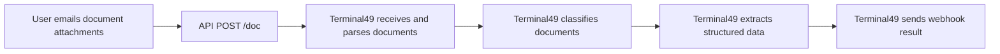

This guide is for first-time integrators building document automation.

You can submit documents in two ways:

- Email attachments to your unique account docs alias
- API endpoint

Both follow the same customer-facing lifecycle: submit -\> classify -\> extract -\> webhook result.

## Workflow Diagrams



## Workflow: Step-by-Step

<Steps>
  <Step title="Submit document">
    Use email (attachments to your docs alias)
  </Step>
  <Step title="Terminal49 processes document">
    Terminal49 classifies and extracts data asynchronously.
  </Step>
  <Step title="Receive webhook result">
    You receive `document.extracted` or `document.extraction_failed`.
  </Step>
  <Step title="Handle duplicates">
    If the same file content already exists for your account, it is treated as duplicate and not processed again.
  </Step>
  <Step title="API POST document">
    POST document through endpoint. Used by email 
  </Step>
</Steps>

<Tip>
  Treat submission as asynchronous. Do not assume extraction is complete immediately after upload/email.
</Tip>

## Technical Implementation (One End-to-End Example)

Example scenario: user uploads one file, `invoice.pdf`.

### 1) Submit the document

`POST /documents`

```json
{
  "data": {
    "type": "document",
    "attributes": {
      "name": "invoice.pdf",
      "attached_document": "eyJfcmFpbHMiOnsibWVzc2FnZSI6IkJBaHBBLi4u"
    }
  }
}
```

Response (`201`):

```json
{
  "data": {
    "id": "5ab53a5e-0d68-4a8f-8d3d-1d24555d20cb",
    "type": "document",
    "attributes": {
      "name": "invoice.pdf",
      "document_type": null,
      "file_name": "invoice.pdf",
      "file_content_type": "application/pdf",
      "file_size_bytes": 248193,
      "created_at": "2026-03-26T08:14:24Z",
      "updated_at": "2026-03-26T08:14:24Z"
    }
  }
}
```

### 2) Receive extraction webhook

`document.extracted` example:

```json
{
  "data": {
    "id": "40cb28de-63ee-4542-909e-a19efe46904d",
    "type": "webhook_notification",
    "attributes": {
      "event": "document.extracted",
      "delivery_status": "pending",
      "created_at": "2026-03-26T08:17:06Z",
      "version": "2026-03-10"
    },
    "relationships": {
      "document": {
        "data": {
          "id": "5ab53a5e-0d68-4a8f-8d3d-1d24555d20cb",
          "type": "document"
        }
      }
    }
  },
  "included": [
    {
      "id": "5ab53a5e-0d68-4a8f-8d3d-1d24555d20cb",
      "type": "document",
      "attributes": {
        "name": "invoice.pdf",
        "document_type": "commercial_invoice",
        "source": "upload",
        "file_name": "invoice.pdf",
        "file_content_type": "application/pdf",
        "file_size_bytes": 248193,
        "created_at": "2026-03-26T08:14:24Z",
        "updated_at": "2026-03-26T08:17:05Z"
      },
      "relationships": {
        "account": {
          "data": {
            "id": "91d5b7cc-6d3f-4c87-b8bb-f5f31ed866f4",
            "type": "account"
          }
        },
        "user": {
          "data": {
            "id": "fa25bdf2-0692-48f9-a8a7-cad8eb99527f",
            "type": "user"
          }
        },
        "email_submission": {
          "data": null
        },
        "parent_document": {
          "data": null
        },
        "last_document_representation": {
          "data": {
            "id": "ab1fba20-6b7b-4d5f-95e8-e2c55a7a8f89",
            "type": "document_representation"
          }
        }
      },
      "links": {
        "self": "/documents/5ab53a5e-0d68-4a8f-8d3d-1d24555d20cb",
        "download": "/documents/5ab53a5e-0d68-4a8f-8d3d-1d24555d20cb/download_url"
      }
    },
    {
      "id": "ab1fba20-6b7b-4d5f-95e8-e2c55a7a8f89",
      "type": "document_representation",
      "attributes": {
        "schema_version": "2026-03-23",
        "payload": {
          "invoice_number": "INV-10027",
          "invoice_date": "2026-03-25",
          "supplier_name": "Acme Manufacturing Ltd",
          "total_amount": "12450.00",
          "currency": "USD"
        },
        "created_at": "2026-03-26T08:17:05Z",
        "updated_at": "2026-03-26T08:17:05Z"
      }
    }
  ]
}
```

### 3) Persist extracted outcome in your system

Use the webhook `event` and included `document` payload to update your internal record for that document.

## Webhooks You Should Handle

| Event | Meaning |
| --- | --- |
| `document.extracted` | Extraction completed successfully |
| `document.extraction_failed` | Extraction did not complete |

Use these endpoints while integrating:

- [`GET /webhook_notifications/examples`](/api-docs/api-reference/webhook-notifications/get-webhook-notification-payload-examples)
- [`POST /webhooks/trigger`](/api-docs/api-reference/webhooks/trigger-a-webhook)

<Info>
  Webhook event availability depends on your account configuration. If you are not receiving expected events, contact Terminal49 support.
</Info>

## APIs Involved

- [`POST /documents`](/api-docs/api-reference/documents/upload-a-document)
- [`GET /documents`](/api-docs/api-reference/documents/list-documents)
- [`GET /documents/{id}`](/api-docs/api-reference/documents/get-a-document)
- [`GET /documents/{id}/download_url`](/api-docs/api-reference/documents/get-a-document-download-url)
- [`GET /email_submissions`](/api-docs/api-reference/email-submissions/list-email-submissions)
- [`GET /email_submissions/{id}`](/api-docs/api-reference/email-submissions/get-an-email-submission)
- [`GET /document_schemas/{id}`](/api-docs/api-reference/document-schemas/get-a-document-schema)
- [`Document representations resource`](/api-docs/api-reference/document-representations/document-representations-resource)

## Planned (Not Live Yet)

- `email_submission.created` webhook event after inbound email acceptance.