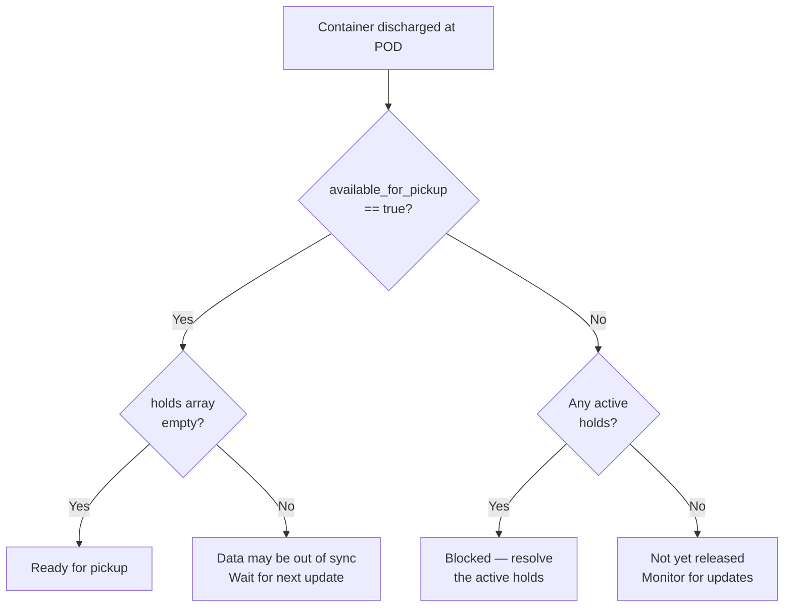

After a container is discharged at the Port of Discharge (POD), the terminal and government agencies may place holds or assess fees before the container can be picked up. For shipments with inland rail moves, holds and fees can also apply at the inland destination. Your integration needs to monitor these fields to determine when a container is actually released and ready for pickup.

Terminal49 normalizes hold and fee data across 150+ terminal sources into two structured arrays on the container object: `holds_at_pod_terminal` and `fees_at_pod_terminal`. This guide shows you how to use them.

<Info>
The field names reference `pod_terminal` for historical reasons, but these fields report hold and fee data regardless of whether the container is at a port terminal or an inland rail destination. The same readiness logic applies in both scenarios.
</Info>

## Determine if a container is ready for pickup

The most common question is straightforward: **can I pick up this container?** You need two fields from the container's `attributes` to answer it:

- `available_for_pickup` — a boolean the terminal sets when the container is cleared for release
- `holds_at_pod_terminal` — an array of active holds blocking pickup

Use them together. A container is ready for pickup when `available_for_pickup` is `true` **and** there are no active holds:

```javascript
function isReadyForPickup(container) {
  const { available_for_pickup, holds_at_pod_terminal } = container.attributes;
  const hasActiveHolds = holds_at_pod_terminal.some(h => h.status === 'hold');
  return available_for_pickup === true && !hasActiveHolds;
}
```

Here is the full decision logic:



<Tip>
Treat `available_for_pickup: true` with an empty holds array as the definitive signal that the container is ready. When holds and `available_for_pickup` disagree — for example, holds are cleared but `available_for_pickup` is still `false` — wait for the next `container.updated` webhook or poll the container again. Terminal data is sourced from multiple systems on varying schedules, so brief inconsistencies can occur.
</Tip>

## Where to find holds and fees

Both fields live on the container's `attributes` object in the V2 API:

- `holds_at_pod_terminal` — active holds blocking or flagging pickup
- `fees_at_pod_terminal` — fees assessed at the terminal

[`GET /v2/containers/{id}`](/api-docs/api-reference/containers/get-a-container)

```json
{
  "data": {
    "id": "3cd51f0e-eb18-4399-9f90-4c8a22250f63",
    "type": "container",
    "attributes": {
      "number": "COSU1186800",
      "available_for_pickup": false,
      "holds_at_pod_terminal": [
        {
          "name": "customs",
          "status": "hold",
          "description": "CBP HOLD"
        }
      ],
      "fees_at_pod_terminal": [
        {
          "type": "demurrage",
          "amount": 850.00,
          "currency_code": "USD"
        }
      ]
    }
  }
}
```

An empty array (`[]`) means there are no active holds or fees of that type.

## Hold types at a glance

Each item in `holds_at_pod_terminal` is a `terminal_hold` object:

| Field | Type | Description |
|-------|------|-------------|
| `name` | string | The canonical hold type (see table below) |
| `status` | string | `"hold"` or `"pending"` |
| `description` | string \| null | Raw text from the terminal, if provided |

When a hold is cleared, the object is removed from the array entirely. There is no `"released"` status — an empty array means no active holds.

| Hold name | Description | Who resolves it |
|-----------|-------------|-----------------|
| `freight` | Carrier freight charges unpaid | Shipping line or freight forwarder |
| `customs` | CBP hold — docs, exam, or inspection | Licensed customs broker |
| `USDA` | USDA phytosanitary inspection | Customs broker or USDA compliance team |
| `VACIS` | Non-intrusive X-ray / gamma-ray scan | Customs broker |
| `TMF` | Terminal management fee (pier pass) | Pay terminal directly |
| `other` | Unmapped hold — check `description` | Terminal or broker |

<Note>
Hold names are case-sensitive. `USDA`, `VACIS`, and `TMF` are uppercase. `freight`, `customs`, and `other` are lowercase. Match values exactly in your code.
</Note>

<AccordionGroup>
  <Accordion title="freight — Carrier freight charges unpaid">
    The ocean carrier has placed a freight hold because the freight charges have not been paid or confirmed. The container will not be released until the carrier lifts this hold.

    ```json
    {
      "name": "freight",
      "status": "hold",
      "description": null
    }
    ```

    **Who resolves it:** Contact the shipping line or your freight forwarder to confirm payment status.
  </Accordion>

  <Accordion title="customs — CBP hold">
    US Customs and Border Protection (CBP) has placed a hold. This can occur due to documentation issues, a random examination, or a targeted inspection. The container cannot be released until CBP clears it.

    ```json
    {
      "name": "customs",
      "status": "hold",
      "description": "CBP HOLD"
    }
    ```

    **Who resolves it:** Your licensed customs broker. Resolution time varies from hours to several days depending on the examination type.
  </Accordion>

  <Accordion title="USDA — Phytosanitary inspection">
    The US Department of Agriculture (USDA) has flagged the shipment for a phytosanitary inspection. Common for shipments containing food, plants, wood packaging, or agricultural products.

    ```json
    {
      "name": "USDA",
      "status": "hold",
      "description": null
    }
    ```

    **Who resolves it:** Your customs broker or USDA compliance team. Inspections typically happen at the terminal or a USDA-approved facility.
  </Accordion>

  <Accordion title="VACIS — Non-intrusive scan">
    The container has been flagged for a VACIS (Vehicle and Cargo Inspection System) scan — a non-intrusive gamma-ray or X-ray inspection conducted by CBP. You may also see this referred to as an NII (Non-Intrusive Inspection) exam.

    ```json
    {
      "name": "VACIS",
      "status": "hold",
      "description": "VACIS EXAM"
    }
    ```

    **Who resolves it:** Your customs broker. The exam fee (if assessed) will appear separately in `fees_at_pod_terminal` as type `"exam"`.
  </Accordion>

  <Accordion title="TMF — Terminal management fee">
    A Terminal Management Fee (TMF) hold is placed by the terminal itself — sometimes called a pier pass or terminal gate fee. This hold is typically resolved by paying the fee directly to the terminal.

    ```json
    {
      "name": "TMF",
      "status": "hold",
      "description": null
    }
    ```

    **Who resolves it:** Pay the terminal fee. Your drayage carrier or port agent can assist.
  </Accordion>

  <Accordion title="other — Unmapped hold type">
    A hold that Terminal49 could not map to a specific type. The raw terminal text, when available, appears in the `description` field.

    ```json
    {
      "name": "other",
      "status": "hold",
      "description": "TERMINAL HOLD - SEE CUSTOMER SERVICE"
    }
    ```

    **What to do:** Use the `description` to identify the specific issue and contact the terminal or your broker for resolution.
  </Accordion>
</AccordionGroup>

<Info>
A `status` of `"pending"` means the terminal has flagged a hold as expected but not yet active. Treat it as a warning that a hold is likely incoming. When the hold becomes active, the status changes to `"hold"` and you receive a `container.updated` webhook notification.
</Info>

## Fee types at a glance

Each item in `fees_at_pod_terminal` is a `terminal_fee` object:

| Field | Type | Description |
|-------|------|-------------|
| `type` | string | The canonical fee type (see table below) |
| `amount` | number | Fee amount in local currency |
| `currency_code` | string | ISO 4217 currency code, typically `"USD"` |

| Fee type | Description | Charged by |
|----------|-------------|------------|
| `demurrage` | Daily charge after carrier free time expires | Ocean carrier |
| `extended_dwell_time` | Terminal charge for prolonged dwell | Terminal |
| `exam` | CBP/USDA inspection cost | Terminal or exam facility |
| `total` | Combined total of all fees (may overlap with line items) | See individual items |
| `other` | Unmapped fee type | Varies |

<AccordionGroup>
  <Accordion title="demurrage — Daily carrier charge">
    A daily charge assessed by the **ocean carrier** when the container is not picked up within the free time period. Demurrage starts accruing after the carrier's free time expires and increases every day.

    ```json
    {
      "type": "demurrage",
      "amount": 1250.00,
      "currency_code": "USD"
    }
    ```

    **Note:** Demurrage is charged by the carrier, not the terminal. The terminal reports it, but you pay the carrier.
  </Accordion>

  <Accordion title="extended_dwell_time — Terminal dwell charge">
    An Extended Dwell Time (EDT) fee charged by the **terminal** (separate from carrier demurrage) when a container sits at the terminal beyond a threshold. Common at major US gateways like the Ports of LA and Long Beach.

    ```json
    {
      "type": "extended_dwell_time",
      "amount": 300.00,
      "currency_code": "USD"
    }
    ```
  </Accordion>

  <Accordion title="exam — Inspection cost">
    Covers the cost of a physical or non-intrusive (VACIS) inspection by CBP or USDA. Exam fees are typically paid to the terminal or a government-approved exam facility. Amounts vary widely — from a few hundred to several thousand dollars depending on the exam type.

    ```json
    {
      "type": "exam",
      "amount": 450.00,
      "currency_code": "USD"
    }
    ```
  </Accordion>

  <Accordion title="total — Combined fee total">
    A combined total of all fees at the terminal, reported as a single line item. Some terminals report only a total rather than individual fee breakdowns. If you see a `total` fee in the array alongside individual line items, filter it out when summing to avoid double-counting.

    ```json
    {
      "type": "total",
      "amount": 2000.00,
      "currency_code": "USD"
    }
    ```
  </Accordion>

  <Accordion title="other — Unmapped fee type">
    A fee that Terminal49 could not map to a specific type.

    ```json
    {
      "type": "other",
      "amount": 75.00,
      "currency_code": "USD"
    }
    ```
  </Accordion>
</AccordionGroup>

## Full example: container with multiple holds and fees

```json
{
  "holds_at_pod_terminal": [
    {
      "name": "customs",
      "status": "hold",
      "description": "CBP HOLD"
    },
    {
      "name": "freight",
      "status": "hold",
      "description": null
    }
  ],
  "fees_at_pod_terminal": [
    {
      "type": "demurrage",
      "amount": 850.00,
      "currency_code": "USD"
    },
    {
      "type": "exam",
      "amount": 450.00,
      "currency_code": "USD"
    }
  ]
}
```

In this example, the container has two active holds (`customs` and `freight`) and two fees. Both holds must be resolved before the container can be released. The demurrage fee will continue increasing daily until the container is picked up.

## Getting notified when holds or fees change

Subscribe to the `container.updated` webhook to run your release-readiness check in real time whenever holds or fees change. The `changeset` on the `container_updated_event` shows the old value and new value side by side — old first, new second.

For full details on setting up webhooks, see [Webhooks](/api-docs/in-depth-guides/webhooks).

<Tabs>
  <Tab title="Hold placed" icon="circle-plus">
    A customs hold appeared on the container:

    ```json
    {
      "changeset": {
        "holds_at_pod_terminal": [
          [],
          [
            {
              "name": "customs",
              "status": "hold",
              "description": "CBP HOLD"
            }
          ]
        ]
      }
    }
    ```
  </Tab>

  <Tab title="Hold cleared" icon="circle-check">
    The customs hold was lifted — the container is now clear:

    ```json
    {
      "changeset": {
        "holds_at_pod_terminal": [
          [
            {
              "name": "customs",
              "status": "hold",
              "description": "CBP HOLD"
            }
          ],
          []
        ]
      }
    }
    ```
  </Tab>

  <Tab title="Pending → Active" icon="arrow-up">
    A pending hold escalated to an active hold:

    ```json
    {
      "changeset": {
        "holds_at_pod_terminal": [
          [
            {
              "name": "customs",
              "status": "pending",
              "description": null
            }
          ],
          [
            {
              "name": "customs",
              "status": "hold",
              "description": "CBP HOLD"
            }
          ]
        ]
      }
    }
    ```
  </Tab>

  <Tab title="Fee updated" icon="dollar-sign">
    Demurrage increased as another day accrued:

    ```json
    {
      "changeset": {
        "fees_at_pod_terminal": [
          [
            {
              "type": "demurrage",
              "amount": 850.00,
              "currency_code": "USD"
            }
          ],
          [
            {
              "type": "demurrage",
              "amount": 1250.00,
              "currency_code": "USD"
            }
          ]
        ]
      }
    }
    ```
  </Tab>
</Tabs>

## Edge cases

- **Empty arrays mean no holds or fees.** An empty `holds_at_pod_terminal: []` or `fees_at_pod_terminal: []` is the normal state for most containers. Do not treat it as missing data or an error.

<Warning>
**Avoid double-counting when `total` is present.** Some terminals report a `total` fee alongside individual line items. Filter it out before summing:

```javascript
const lineItems = container.fees_at_pod_terminal.filter(f => f.type !== 'total');
const totalAmount = lineItems.reduce((acc, f) => acc + f.amount, 0);
```
</Warning>

<Info>
**Fee amount of `0` is valid.** A fee amount of `0` means the terminal reported the fee type but has not yet calculated or posted the dollar amount. This is common for demurrage in the first day or two after discharge. Poll the container or wait for the next `container.updated` event.
</Info>

<Note>
**The `description` field is raw terminal text.** The `description` on hold objects is unstructured text scraped directly from the terminal. It is useful context for humans but should not be used for programmatic decision-making. Use the `name` field to drive automation logic.
</Note>

## Frequently asked questions

<AccordionGroup>
  <Accordion title="How do I know when a container is ready for pickup?">
    Check two fields together: `available_for_pickup` must be `true` **and** the `holds_at_pod_terminal` array must have no items with `status: "hold"`. See the [decision logic and code example](#determine-if-a-container-is-ready-for-pickup) above.
  </Accordion>

  <Accordion title="Can a container have holds and fees at the same time?">
    Yes. Holds and fees are independent. Holds block pickup — your container cannot be released until all holds are cleared. Fees are charges you owe (demurrage, exam costs, etc.) that may continue accruing whether or not holds are present.
  </Accordion>

  <Accordion title="What happens when a hold is cleared?">
    The hold object is removed from the `holds_at_pod_terminal` array entirely. There is no `"released"` status — an empty array means no active holds. You receive a `container.updated` webhook when this happens.
  </Accordion>

  <Accordion title="Why does available_for_pickup say false when there are no holds?">
    Terminal data is sourced from multiple systems on varying schedules. A hold can clear before the terminal updates `available_for_pickup`, or vice versa. Wait for the next `container.updated` webhook or poll the container again. Treat `available_for_pickup: true` with an empty holds array as the definitive readiness signal.
  </Accordion>

  <Accordion title="Do holds and fees apply at inland rail destinations?">
    Yes. The `holds_at_pod_terminal` and `fees_at_pod_terminal` fields report data regardless of whether the container is at a port terminal or an inland rail destination. The field names reference `pod_terminal` for historical reasons, but the same readiness logic applies in both scenarios.
  </Accordion>

  <Accordion title="How do I calculate total fees without double-counting?">
    Some terminals report a `total` fee alongside individual line items. Filter it out before summing:

    ```javascript
    const lineItems = container.fees_at_pod_terminal.filter(f => f.type !== 'total');
    const totalAmount = lineItems.reduce((acc, f) => acc + f.amount, 0);
    ```
  </Accordion>
</AccordionGroup>

## Related guides

<CardGroup cols={2}>
  <Card title="Container Statuses" icon="signal-bars" href="/api-docs/in-depth-guides/container-statuses">
    How `available_for_pickup` and `current_status` are derived
  </Card>
  <Card title="Webhooks" icon="webhook" href="/api-docs/in-depth-guides/webhooks">
    Subscribe to `container.updated` events
  </Card>
  <Card title="Event Timestamps" icon="clock" href="/api-docs/in-depth-guides/event-timestamps">
    When terminal data was captured
  </Card>
  <Card title="Rail Integration" icon="train" href="/api-docs/in-depth-guides/rail-integration-guide">
    Inland rail moves and container tracking at rail destinations
  </Card>
</CardGroup>
