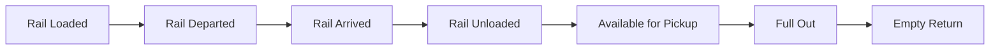

This is a technical article about rail data within Terminal49's API and DataSync.

For a broader overview, including the reasons why you'd want rail visibility and how to use it in the Terminal49 dashboard,
 [read our announcement post](https://www.terminal49.com/blog/launching-north-american-intermodal-rail-visibility-on-terminal49/).

## Table of Contents

- [Supported Rail Carriers](#supported-rail-carriers)
- [Supported Rail Events and Data Attributes](#supported-rail-events-and-data-attributes)
  - [Rail-specific Transport Events](#rail-specific-transport-events)
  - [Webhook Notifications](#webhook-notifications)
  - [Rail Container Attributes](#rail-container-attributes)
- [Integration Methods](#integration-methods)
  - [Integration via API](#a-integration-via-api)
  - [Integration via DataSync](#b-integration-via-datasync)

## Supported Rail Carriers

Terminal49 container tracking platform integrates with all North American Class-1 railroads that handle container shipping, providing comprehensive visibility into your rail container movements.

- BNSF Railway
- Canadian National Railway (CN)
- Canadian Pacific Railway (CP)
- CSX Transportation
- Norfolk Southern Railway (NS)
- Union Pacific Railroad (UP)

By integrating with these carriers, Terminal49 ensures that you have direct access to critical tracking data, enabling better decision-making and operational efficiency.

## Supported Rail Events and Data Attributes

Terminal49 seamlessly tracks your containers as they go from container ship, to ocean terminal, to rail carrier.

We provide a [set of Transport Events](#webhook-notifications) that let you track the status of your containers as they move through the rail system.  You can be notified by webhook whenever these events occur.

We also provide a set of attributes [on the container model](/api-docs/api-reference/containers/get-a-container) that let you know the current status of your container at any given time, as well as useful information such as ETA, pickup facility, and availability information.

### Rail-Specific Transport Events

There are several core Transport Events that occur on most rail journeys.  Some rail carriers do not share all events, (see [Rail Coverage](/api-docs/useful-info/api-data-sources-availability#rail-coverage) for more details), but in general these are the key events for a container.



`Available for Pickup`, `Full Out` and `Empty Return` are not specific to rail, but are included here since they are a key part of the rail journey.

{/* However, not all shipments have a simple journey.  You may want to track events such as when a train passes through a town, when the container switches trains or rail carriers at an interchange, and when the status of your container at the terminal changes.

This is a more complex diagram that shows the various events that can occur in a container's rail journey.

```mermaid
graph LR
    Y[From ocean terminal or carrier] --> A
    Z[Rail Interchange Received] --> B
    A[Rail Loaded] --> B[Rail Departed]
    B --> L[Train Passing]
    B --> C[Rail Arrived]
    L --> L
    L --> C
    C --> D[Rail Unloaded]
    C --> X[Rail Interchange Delivered]
    X --> Z
    D --> G[Available for Pickup]
    D --> H[Not Available]
    H -- Holds and Fees Updated --> H
    G --> H
    H --> G
    G --> E[Full Out]
    E --> F[Empty Return]
``` */}

In addition, there are events that update you on the status of your container at the rail terminal, marking it as available or unavailable.  Some of these events come directly from the carriers, while others we generate when we see the fees and holds on your container change.

```mermaid
graph LR
    C[Previous events] --> D[Rail Unloaded]
    D --> G[Available for Pickup]
    D --> H[Not Available]
    G --> H
    H --> G
    H -- Holds and Fees Updated --> H
    G --> E[Full Out]
```

### Webhook Notifications

Terminal49 provides webhook notifications to keep you updated on key Transport Events in a container's rail journey. These notifications allow you to integrate near real-time tracking data directly into your applications.

Here's a list of the rail-specific events which support webhook notifications:

| Transport Event | Webhook Notification | Description |
|----------------|----------------------|-------------|
| Rail Loaded    | `container.transport.rail_loaded`   | The container is loaded onto a railcar. |
| Rail Departed  | `container.transport.rail_departed` | The container departs on the railcar (not always from port of discharge). |
| Rail Arrived   | `container.transport.rail_arrived`  | The container arrives at a rail terminal (not always at the destination terminal). |
| Arrived At Inland Destination | `container.transport.arrived_at_inland_destination` | The container arrives at the destination terminal. |
| Rail Unloaded  | `container.transport.rail_unloaded` | The container is unloaded from a railcar. |

There's also a set of events that are triggered when the status of the container at the destination rail terminal changes.  For containers without rail, they would have been triggered at the ocean terminal.

| Transport Event | Webhook Notification | Description |
|----------------|----------------------|-------------|
| Available for Pickup | `container.transport.available`     | (Coming Soon) The container is available for pickup at the rail terminal. |
| Not Available  | `container.transport.not_available` | (Coming Soon) The container is not available for pickup at the rail terminal. |
| Holds and Fees Updated | `container.transport.holds_and_fees_updated` | (Coming Soon) The holds and fees for the container at the rail terminal have been changed, but not fully cleared. |
| Full Out       | `container.transport.full_out`      | The full container leaves the rail terminal. |
| Empty In       | `container.transport.empty_in`      | The empty container is returned to the terminal. |

Finally, we have a webhook notifications for when the destination ETA changes.

| Transport Event | Webhook Notification | Description |
|----------------|----------------------|-------------|
| Estimated Destination Arrival | `container.transport.estimated.arrived_at_inland_destination` | Estimated time of arrival for the container at the destination rail terminal. |

Integrate these notifications by subscribing to the webhooks and handling the incoming data to update your systems.

#### Rail Container Attributes

The following are new attributes that are specific to rail container tracking.

- **pod_rail_loaded_at**: Time when the container is loaded onto a railcar at the POD.
- **pod_rail_departed_at**: Time when the container departs from the POD.
- **inland_destination_eta_at**: Estimated Time of Arrival at the destination terminal.
- **inland_destination_ata_at**: Actual Time of Arrival at the destination terminal.
- **inland_destination_rail_unloaded_at**: Time when the container is unloaded from the rail terminal.
- **pickup_facility_holds**: Holds placed on the container at the rail terminal.
- **pickup_facility_fees**: Fees associated with the container at the rail terminal.
- **pickup_facility_yard_location**: Yard location of the container at the rail terminal.
- **pickup_facility_lfd_on**: Last Free Day for demurrage charges.
- **pickup_rail_carrier_scac**: SCAC code of the rail carrier that picks up the container from the POD (this could be different than the rail carrier that delivers to the destination terminal). {/* Linear ticket to rename: https://linear.app/terminal49/issue/DATA-2767/rename-pickup-rail-carrier-scac */}
{/* Linear ticket to add matching delivery/destination rail carrier scac: https://linear.app/terminal49/issue/DATA-2768/add-destination-rail-carrier-scac-to-serializer */}


{/* TODO: Look at the other container attributes that could be fed via rail but are currently shipping-line-only.  Such as :current_issues, :pickup_appointment_at, :availability_known, :available_for_pickup  */}

These attributes can be found on [container objects](/api-docs/api-reference/containers/get-a-container).

## Integration Methods

There are two methods to integrate Terminal49's rail tracking data programmatically: via API and DataSync.

### A. Integration via API

Terminal49 provides a robust API that allows you to programmatically access rail container tracking data and receive updates via webhooks. You will receive rail events and attributes alongside events and attributes from the ocean terminal and carrier.

[Here's a step-by-step guide to get started](/api-docs/getting-started/start-here)


### B. Integration via DataSync

Terminal49's DataSync service automatically syncs up-to-date tracking data with your system.  The rail data will be in the same tables alongside the ocean terminal and carrier data.

[Learn more about DataSync](/datasync/overview)
