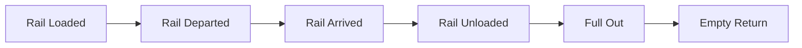
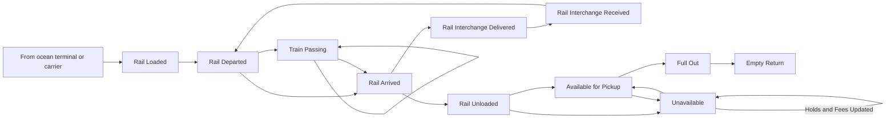

{/* TODO - maybe a table of contents? */}

## Terminal49 Rail Integrations Overview

Terminal49 container tracking platform integrates with all major North American Class-1 railroads, providing comprehensive visibility into rail container movements. Our platform supports the following carriers:

### Supported Rail Carriers
- BNSF Railway
- Canadian National Railway (CN)
- Canadian Pacific Railway (CP)
- CSX Transportation
- Norfolk Southern Railway (NS)
- Union Pacific Railroad (UP)

By integrating with these carriers, Terminal49 ensures that you have real-time access to critical tracking data, enabling better decision-making and operational efficiency.

### Supported Rail Milestones and Data Attributes

Terminal49 tracks various milestones and data attributes that are essential for effective rail container management. The key events and attributes include:

Terminal49 seamlessly tracks your containers as they go from container ship, to ocean terminal, to rail carrier.

We provide a set of milestones/events that let you track the status of your containers as they move through the rail system.  Each milestone contains a timestamp and a location.

We also provide a set of attributes that let you know the current status of your container at any given time, as well as useful information such as ETA, pickup facility, and availability information.

#### Rail Milestones (aka rail events)

{/* TODO: create rail-carriers page or section */}
There are several core milestones that occur on most rail journeys.  Some rail carriers do not share all events (see [Rail Carriers](#rail-carriers) for more details), but in general these are the key events for a container.

However, not all shipments have a simple journey.  Yo umay want to track events such as when a train passes through a town, when the container switches trains or rail carriers at an interchange, and when the status of your container at the terminal changes.

This is a more complex diagram that shows the various events that can occur in a container's rail journey.

Terminal49 provides a series of webhook notifications to keep you updated on key milestones in a container's rail journey. These notifications allow you to integrate near real-time tracking data directly into your applications. Here's a list of the supported rail events:

{/* TODO: update this list to include all the others we have listed */}

| Milestone | Webhook Notification | Description |
|----------------|----------------------|-------------|
| Rail Loaded    | `container.transport.rail_loaded`   | The container is loaded onto a railcar. |
| Rail Departed  | `container.transport.rail_departed` | The container departs on the railcar (usually from port of discharge). |
| Rail Arrived   | `container.transport.rail_arrived`  | The container arrives at the destination terminal. |
| Rail Unloaded  | `container.transport.rail_unloaded` | The container is unloaded from a railcar. |
| Full Out       | `container.transport.full_out`      | The full container leaves the rail terminal. |
| Empty In       | `container.transport.empty_in`      | The empty container is returned to the terminal. |
| Estimated Rail Arrival | `container.estimated.rail_arrival` | (Coming soon) Estimated time of arrival for the container at the rail terminal. |

Integrate these notifications by subscribing to the webhooks and handling the incoming data to update your systems.

#### Rail Container Attributes
- **Pickup Facility**: Information about the inland destination, rail terminal, and FIRMS code.
- **Rail ETA**: Estimated Time of Arrival at the destination terminal.
- **Rail ATA**: Actual Time of Arrival at the destination terminal.
- **Available for Pickup**: Status indicating when the container is available for pickup.
- **Demurrage LFD**: Last Free Day for demurrage charges.
- **Rail Terminal Holds**: Holds placed on the container at the rail terminal.
- **Rail Terminal Fees**: Fees associated with the container at the rail terminal.

### Integration Methods

There are two primary methods to integrate Terminal49's rail tracking data programmatically: via API and DataSync.

**A. Integration via API**

Terminal49 provides a robust API that allows you to programmatically access rail container tracking data and receive updates via webhooks. Here's a step-by-step guide to get started:

**B. Integration via DataSync**

Terminal49's DataSync service automatically syncs up-to-date tracking data with your system. Here's how to set it up:

---
Other Links
- [Blog post on North American intermodal rail visibility](https://www.terminal49.com/blog/launching-north-american-intermodal-rail-visibility-on-terminal49/).

If you have any questions or need further assistance, please contact Terminal49 support.