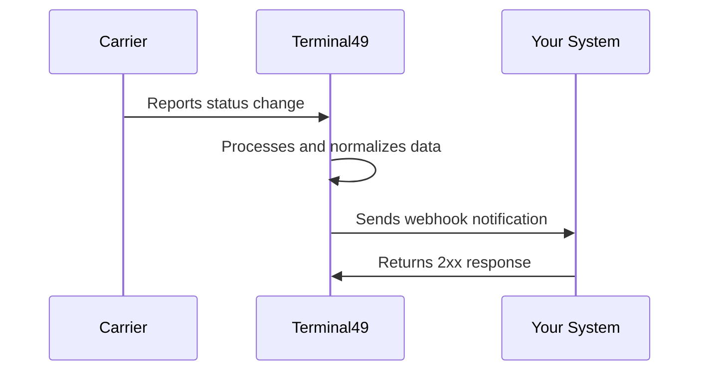

Terminal49 tracking is fully event-driven. When a carrier reports a status change, Terminal49 processes it and pushes a webhook notification to your system within minutes. You never need to poll.

## How it works

1. You [create a tracking request](/docs/api-docs/getting-started/tracking-shipments-and-containers) with a Bill of Lading (BOL) or container number.
2. Terminal49 monitors the carrier and destination terminal for changes.
3. When something changes — an ETA update, a milestone event, a container hold — Terminal49 sends a `POST` request to your webhook URL with the full event payload.
4. Your system processes the event and returns a `2xx` status code.

## Why webhooks instead of polling

| | Webhooks | Polling |
|---|---|---|
| **Latency** | Minutes after carrier reports | Depends on your poll interval |
| **Efficiency** | Only fires when data changes | Most requests return unchanged data |
| **Rate limits** | No API calls consumed | Each poll consumes a request |
| **Complexity** | Handle incoming POST requests | Build and maintain a polling loop |
| **Recommended** | Yes | Only for on-demand data retrieval |

Terminal49 exposes over 30 distinct events covering the full container lifecycle — from empty-out at origin to empty-return at destination. Webhooks let you react to each of these in real time.

<Warning>
Polling the API to check for updates is discouraged. It consumes your rate limit, adds latency, and misses the event context that webhooks provide (such as which specific field changed on a `container.updated` event). Use the [List](/docs/api-docs/api-reference/shipments/list-shipments) and [Get](/docs/api-docs/api-reference/shipments/get-a-shipment) endpoints for on-demand lookups, not status monitoring.
</Warning>

## What you can do with webhooks

Webhooks power most Terminal49 integrations. Common patterns include:

- **[ETA monitoring](/docs/api-docs/webhooks/use-cases/eta-monitoring)** — alert your team when a shipment's arrival estimate changes
- **[LFD and availability alerts](/docs/api-docs/webhooks/use-cases/lfd-alerts)** — trigger dispatch when a container clears holds and is ready for pickup
- **[Milestone tracking](/docs/api-docs/webhooks/use-cases/milestone-tracking)** — build a complete timeline of a container's journey from origin to destination
- **Data sync** — push every update into your database, ERP, or TMS as it happens
- **Customer notifications** — surface tracking updates to your end customers in real time

## Secure your endpoint

Before using webhooks in production:

- Verify the `X-T49-Webhook-Signature` HMAC signature against the raw request body.
- Allowlist Terminal49 webhook IPs with the [List Webhook IPs](/docs/api-docs/api-reference/webhooks/list-webhook-ips) endpoint.
- Make handlers idempotent because retries can deliver the same notification more than once.
- Return a 2xx response only after you have safely accepted the event.

See [Setting up webhooks](/docs/api-docs/in-depth-guides/webhooks) for signature examples and [Webhook Best Practices](/docs/api-docs/webhooks/best-practices) for retry handling.

## Next steps

<CardGroup cols={3}>
  <Card title="Set up webhooks" icon="gear" href="/docs/api-docs/in-depth-guides/webhooks">
    Create your first webhook and subscribe to events.
  </Card>
  <Card title="Event catalog" icon="list" href="/docs/api-docs/webhooks/event-catalog">
    Browse all available webhook events by category.
  </Card>
  <Card title="Payloads" icon="brackets-curly" href="/docs/api-docs/webhooks/payloads">
    Review the notification envelope and included resources.
  </Card>
</CardGroup>
