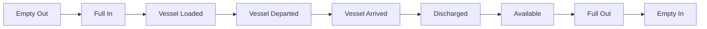

A container's journey from origin to destination passes through a predictable sequence of milestones. Terminal49 sends a webhook event for each milestone so you can build a real-time timeline without polling.

## The container journey



For containers with transshipments, feeder vessels, or inland rail moves, additional milestone events fire at each intermediate point.

## Events in journey order

### Origin to vessel

| Event | Milestone |
|-------|-----------|
| `container.transport.empty_out` | Empty container picked up at origin |
| `container.transport.full_in` | Full container gated in at port of lading |
| `container.transport.vessel_loaded` | Loaded onto vessel |
| `container.transport.vessel_departed` | Vessel departed port of lading |

### Transshipment (if applicable)

| Event | Milestone |
|-------|-----------|
| `container.transport.transshipment_arrived` | Arrived at transshipment port |
| `container.transport.transshipment_discharged` | Discharged at transshipment port |
| `container.transport.transshipment_loaded` | Loaded onto next vessel |
| `container.transport.transshipment_departed` | Departed transshipment port |

### Destination

| Event | Milestone |
|-------|-----------|
| `container.transport.vessel_arrived` | Vessel arrived at port of discharge |
| `container.transport.vessel_berthed` | Vessel berthed at port of discharge |
| `container.transport.vessel_discharged` | Container discharged from vessel |
| `container.transport.available` | Available for pickup |
| `container.transport.full_out` | Picked up from terminal |
| `container.transport.empty_in` | Empty returned |

### Rail (if applicable)

| Event | Milestone |
|-------|-----------|
| `container.transport.rail_loaded` | Loaded onto rail |
| `container.transport.rail_departed` | Rail departed |
| `container.transport.rail_arrived` | Rail arrived at inland ramp |
| `container.transport.rail_unloaded` | Unloaded from rail |
| `container.transport.arrived_at_inland_destination` | Arrived at final inland destination |

## Build a milestone timeline

Each transport event webhook includes a `transport_event` object in the `included` array with the event type, timestamp, and location:

```javascript
app.post("/webhooks/terminal49", (req, res) => {
  const { data, included } = req.body;
  const event = data.attributes.event;

  if (!event.startsWith("container.transport.")) {
    return res.sendStatus(200);
  }

  const transportEvent = included.find((obj) => obj.type === "transport_event");
  const container = included.find((obj) => obj.type === "container");
  const shipment = included.find((obj) => obj.type === "shipment");

  const milestone = {
    containerNumber: container.attributes.number,
    bolNumber: shipment.attributes.bill_of_lading_number,
    event: event,
    timestamp: transportEvent.attributes.timestamp,
    timezone: transportEvent.attributes.timezone,
    location: transportEvent.attributes.location_locode,
    voyageNumber: transportEvent.attributes.voyage_number,
  };

  await saveMilestone(milestone);

  res.sendStatus(200);
});
```

<Info>
Transport event timestamps are stored in UTC. Use the `timezone` field to convert to local time. See [Event Timestamps](/api-docs/in-depth-guides/event-timestamps) for details.
</Info>

## Common patterns

- **Customer portal** — display a visual timeline showing where each container is in its journey
- **Dwell time tracking** — measure time between `vessel_arrived` and `full_out` to identify port delays
- **Transit time analysis** — compare `vessel_departed` to `vessel_arrived` across carriers and routes
- **Exception detection** — alert when a container has been at a milestone for longer than expected
- **Export visibility** — track `empty_out` through `vessel_departed` for outbound shipments

## Related

- [Event catalog](/api-docs/webhooks/event-catalog) — full list of events with descriptions
- [Container statuses](/api-docs/in-depth-guides/container-statuses) — how Terminal49 derives container status from milestones
- [Rail integration](/api-docs/in-depth-guides/rail-integration-guide) — details on rail-specific tracking data
- [Routing data](/api-docs/in-depth-guides/routing) — vessel and container route information
