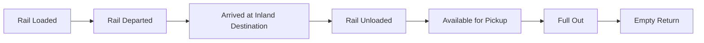

Terminal49 keeps tracking after the container leaves the ocean terminal. For inland moves on North American rail, the same container and shipment objects pick up rail milestones, the rail carrier's ETA, and the rail last free day — no separate tracking request needed.

<Note>
  Rail last free day data (`import_deadlines.pickup_lfd_rail` and the
  `container.pickup_lfd_rail.changed` webhook) requires the Rail Plan on your
  account. See [entitlements](/api-docs/useful-info/entitlements).
</Note>

## North American Class I rail

Terminal49 covers all six Class I railroads that move intermodal containers in North America:

| Carrier | SCAC |
| ------- | ---- |
| BNSF Railway | BNSF |
| Canadian National Railway | CNRU |
| Canadian Pacific Railway | CPRS |
| CSX Transportation | CSXT |
| Norfolk Southern | NSRR |
| Union Pacific | UPRR |

## What you get

- Rail loaded, departed, arrived, and unloaded events
- Arrival at the inland destination, with the rail carrier's ETA and ATA
- Rail last free day (LFD) at the inland facility — requires the [Rail Plan](/api-docs/useful-info/entitlements)
- Pickup availability after unload
- The rail carrier SCAC at port of discharge and at the inland destination (they can differ)

See the [rail integration guide](/api-docs/in-depth-guides/rail-integration-guide) for webhook names, container attributes, and API vs DataSync setup.

## Rail events

| Event | Webhook |
| ----- | ------- |
| Rail loaded | `container.transport.rail_loaded` |
| Rail departed | `container.transport.rail_departed` |
| Rail arrived | `container.transport.rail_arrived` |
| Arrived at inland destination | `container.transport.arrived_at_inland_destination` |
| Rail unloaded | `container.transport.rail_unloaded` |
| Rail LFD changed | `container.pickup_lfd_rail.changed` |
| Inland ETA changed | `container.transport.estimated.arrived_at_inland_destination` |

Some railroads do not share every event. The events above are the ones you should plan around.

## Inland ETA: rail vs shipping line

For an inland move, two arrival views can differ:

| Field | Lives on | Source |
| ----- | -------- | ------ |
| `ind_eta_at` / `ind_ata_at` | container | Rail carrier |
| `destination_eta_at` / `destination_ata_at` | shipment | Ocean carrier |

Use the rail fields when you want the inland railroad's view. Use the shipment fields when you want the ocean carrier's view of the same destination.

## Rail last free day

`pickup_lfd` on the container is coalesced from `import_deadlines`, in this order:

1. `pickup_lfd_line` — shipping line
2. `pickup_lfd_terminal` — port of discharge terminal
3. `pickup_lfd_rail` — rail carrier at the inland destination

Subscribe to `container.pickup_lfd_rail.changed` when you need the inland railroad's LFD specifically. Rail LFD data requires the [Rail Plan](/api-docs/useful-info/entitlements); without it, `pickup_lfd_rail` values and the webhook are not delivered.
