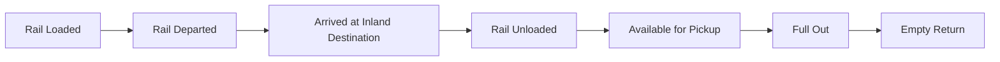

import { CarrierCoverageExplorer, CarrierCoverageStatus, CarrierCoverageDetails } from "/snippets/data-sources/carrier-coverage.mdx";
import { railCarriers, railCarrierFeatures, railCarrierCoverage, coverageUpdatedOn } from "/snippets/data-sources/carrier-feature-data.mdx";

Terminal49 keeps tracking after the container leaves the ocean terminal. For inland moves on North American rail, the same container and shipment objects pick up rail milestones, the rail carrier's ETA, and the rail last free day — no separate tracking request needed.

<Note>
  Rail last free day data (`import_deadlines.pickup_lfd_rail` and the
  `container.pickup_lfd_rail.changed` webhook) requires the Rail Plan on your
  account. See [entitlements](/api-docs/useful-info/entitlements).
</Note>

## North American Class I rail

Terminal49 covers all six Class I railroads that move intermodal containers in North America:

Search by carrier name or Standard Carrier Alpha Code (SCAC), filter by a required feature, and expand a row for the full feature coverage.

T49 Rail ETA shows Terminal49 estimate coverage; Carrier ETA shows estimates supplied by the railroad.

<CarrierCoverageExplorer carriers={railCarriers} features={railCarrierFeatures} coverage={railCarrierCoverage} summaryKeys={["railArrived", "available", "lastFreeDay", "estArrivalAtDestination", "t49RailEta"]} carrierLabel="Rail carrier" updatedOn={coverageUpdatedOn} />

[Complete rail carrier feature table](/data/coverage/rail-carriers) · [JSON](/data/coverage/rail-carriers.json) · [CSV](/data/coverage/rail-carriers.csv)

Browse the [complete inland rail terminal directory](/coverage/inland-rail-terminals) for terminal names, locations, and facility codes.

<Note>
  Features marked “Requires carrier credentials” need authenticated access to the
  rail carrier. [Contact support](mailto:support@terminal49.com) to confirm setup
  for your account. Carrier credentials and the [Rail
  Plan](/api-docs/useful-info/entitlements) are separate requirements.
</Note>

## Rail data

Feature availability varies by rail carrier. Expand a carrier above to check support for:

- Rail loaded, departed, arrived, and unloaded events
- Arrival at the inland destination, with the rail carrier's ETA and ATA
- Rail last free day (LFD) at the inland facility — requires the [Rail Plan](/api-docs/useful-info/entitlements)
- Pickup availability after unload
- The rail carrier SCAC at port of discharge and at the inland destination (they can differ)

See the [rail integration guide](/api-docs/in-depth-guides/rail-integration-guide) for webhook names, container attributes, and API vs DataSync setup.

## Rail events

```mermaid
graph LR
A[Rail Loaded] --> B[Rail Departed]
B --> C[Arrived at Inland Destination]
C --> D[Rail Unloaded]
D --> G[Available for Pickup]
G --> E[Full Out]
E --> F[Empty Return]
```

| Event | Webhook |
| ----- | ------- |
| Rail loaded | `container.transport.rail_loaded` |
| Rail departed | `container.transport.rail_departed` |
| Rail arrived | `container.transport.rail_arrived` |
| Arrived at inland destination | `container.transport.arrived_at_inland_destination` |
| Rail unloaded | `container.transport.rail_unloaded` |
| Rail LFD changed | `container.pickup_lfd_rail.changed` |
| Inland ETA changed | `container.transport.estimated.arrived_at_inland_destination` |

Some railroads do not share every event. The events above are the ones you should plan around.

## Inland ETA: rail vs shipping line

For an inland move, two arrival views can differ:

| Field | Lives on | Source |
| ----- | -------- | ------ |
| `ind_eta_at` / `ind_ata_at` | container | Rail carrier |
| `destination_eta_at` / `destination_ata_at` | shipment | Ocean carrier |

Use the rail fields when you want the inland railroad's view. Use the shipment fields when you want the ocean carrier's view of the same destination.

## Rail last free day

`pickup_lfd` on the container is coalesced from `import_deadlines`, in this order:

1. `pickup_lfd_line` — shipping line
2. `pickup_lfd_terminal` — port of discharge terminal
3. `pickup_lfd_rail` — rail carrier at the inland destination

Subscribe to `container.pickup_lfd_rail.changed` when you need the inland railroad's LFD specifically. Rail LFD data requires the [Rail Plan](/api-docs/useful-info/entitlements); without it, `pickup_lfd_rail` values and the webhook are not delivered.

{/* coverage-agent-data:start */}
<Visibility for="agents">

## Complete structured coverage

Last updated 2026-10-09.

[Download JSON](/data/coverage/rail-carriers.json).

Supported means the source returns the feature when applicable. Partial means it returns the feature in some cases. Not supported means this source does not return the feature. Unknown means no feature assessment is available. Carrier credentials required means the feature requires credentials for the carrier integration.

Coverage describes integration capabilities. A supported field may be absent until its milestone occurs. We continually improve our integrations. Contact support to confirm current coverage.

Rail Last Free Day (LFD) requires the Rail Plan. This entitlement is separate from carrier credential requirements.

Standard Carrier Alpha Code (SCAC) identifies carriers. Terminal identities include the port location code and terminal code.

## BNSF Railway

SCAC `BNSF`. US Class I.

| Section | Feature | Coverage |
| --- | --- | --- |
| Container milestones | Rail Loaded | Not supported |
| Container milestones | Rail Departed | Not supported |
| Container milestones | Rail Arrived | Supported |
| Container milestones | Rail Unloaded | Not supported |
| Container milestones | Arrived At Destination | Supported |
| Container milestones | Available | Supported |
| Container milestones | Full Out | Not supported |
| Container milestones | Empty Returned | Not supported |
| Rail attributes | Rail LFD | Supported |
| Rail attributes | Carrier ETA | Supported |
| Rail attributes | POD Rail Carrier | Supported |
| Rail attributes | Destination Rail Carrier | Supported |
| Terminal49 estimates | T49 Rail ETA | Supported |

## Union Pacific

SCAC `UPRR`. US Class I.

| Section | Feature | Coverage |
| --- | --- | --- |
| Container milestones | Rail Loaded | Not supported |
| Container milestones | Rail Departed | Supported |
| Container milestones | Rail Arrived | Supported |
| Container milestones | Rail Unloaded | Not supported |
| Container milestones | Arrived At Destination | Partial |
| Container milestones | Available | Supported |
| Container milestones | Full Out | Supported |
| Container milestones | Empty Returned | Partial |
| Rail attributes | Rail LFD | Supported |
| Rail attributes | Carrier ETA | Supported |
| Rail attributes | POD Rail Carrier | Supported |
| Rail attributes | Destination Rail Carrier | Supported |
| Terminal49 estimates | T49 Rail ETA | Supported |

## Norfolk Southern

SCAC `NSRR`. US Class I.

| Section | Feature | Coverage |
| --- | --- | --- |
| Container milestones | Rail Loaded | Carrier credentials required |
| Container milestones | Rail Departed | Carrier credentials required |
| Container milestones | Rail Arrived | Carrier credentials required |
| Container milestones | Rail Unloaded | Partial |
| Container milestones | Arrived At Destination | Supported |
| Container milestones | Available | Partial |
| Container milestones | Full Out | Partial |
| Container milestones | Empty Returned | Not supported |
| Rail attributes | Rail LFD | Partial |
| Rail attributes | Carrier ETA | Carrier credentials required |
| Rail attributes | POD Rail Carrier | Supported |
| Rail attributes | Destination Rail Carrier | Supported |
| Terminal49 estimates | T49 Rail ETA | Supported |

## CSX

SCAC `CSXT`. US Class I.

| Section | Feature | Coverage |
| --- | --- | --- |
| Container milestones | Rail Loaded | Partial |
| Container milestones | Rail Departed | Supported |
| Container milestones | Rail Arrived | Supported |
| Container milestones | Rail Unloaded | Supported |
| Container milestones | Arrived At Destination | Supported |
| Container milestones | Available | Supported |
| Container milestones | Full Out | Not supported |
| Container milestones | Empty Returned | Not supported |
| Rail attributes | Rail LFD | Supported |
| Rail attributes | Carrier ETA | Supported |
| Rail attributes | POD Rail Carrier | Supported |
| Rail attributes | Destination Rail Carrier | Supported |
| Terminal49 estimates | T49 Rail ETA | Supported |

## Canadian National

SCAC `CNRU`. Canadian Class I.

| Section | Feature | Coverage |
| --- | --- | --- |
| Container milestones | Rail Loaded | Supported |
| Container milestones | Rail Departed | Supported |
| Container milestones | Rail Arrived | Supported |
| Container milestones | Rail Unloaded | Partial |
| Container milestones | Arrived At Destination | Supported |
| Container milestones | Available | Partial |
| Container milestones | Full Out | Supported |
| Container milestones | Empty Returned | Not supported |
| Rail attributes | Rail LFD | Supported |
| Rail attributes | Carrier ETA | Supported |
| Rail attributes | POD Rail Carrier | Supported |
| Rail attributes | Destination Rail Carrier | Supported |
| Terminal49 estimates | T49 Rail ETA | Supported |

## Canadian Pacific / KCS

SCAC `CPRS`. Canadian Class I.

| Section | Feature | Coverage |
| --- | --- | --- |
| Container milestones | Rail Loaded | Not supported |
| Container milestones | Rail Departed | Carrier credentials required |
| Container milestones | Rail Arrived | Carrier credentials required |
| Container milestones | Rail Unloaded | Not supported |
| Container milestones | Arrived At Destination | Carrier credentials required |
| Container milestones | Available | Carrier credentials required |
| Container milestones | Full Out | Carrier credentials required |
| Container milestones | Empty Returned | Not supported |
| Rail attributes | Rail LFD | Supported |
| Rail attributes | Carrier ETA | Supported |
| Rail attributes | POD Rail Carrier | Supported |
| Rail attributes | Destination Rail Carrier | Supported |
| Terminal49 estimates | T49 Rail ETA | Supported |

</Visibility>
{/* coverage-agent-data:end */}
